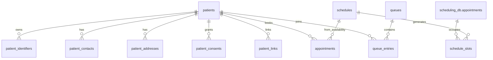
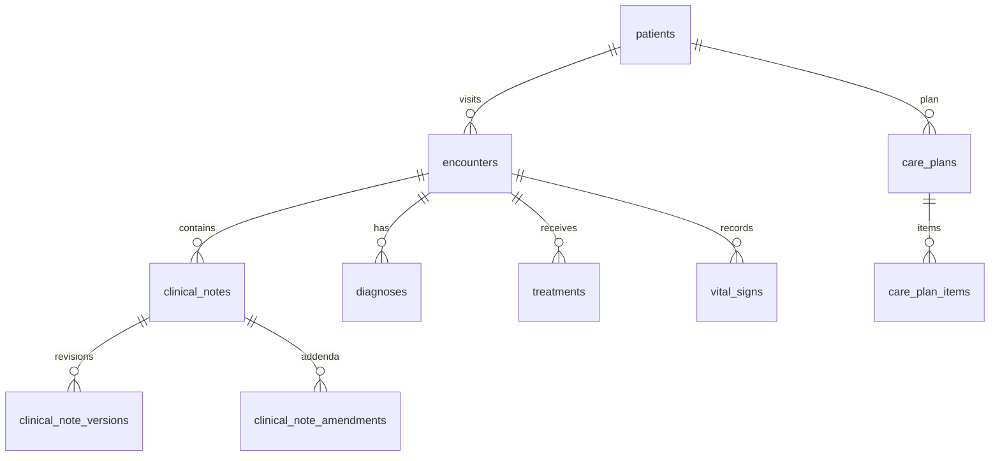
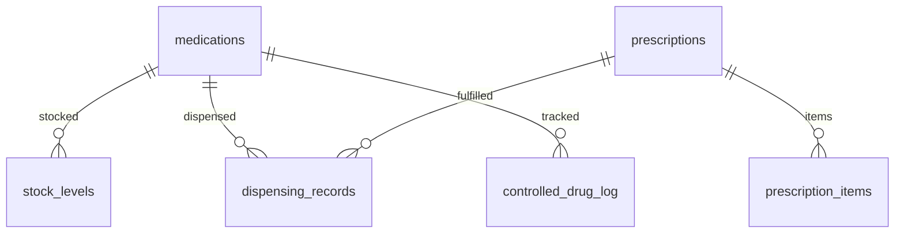
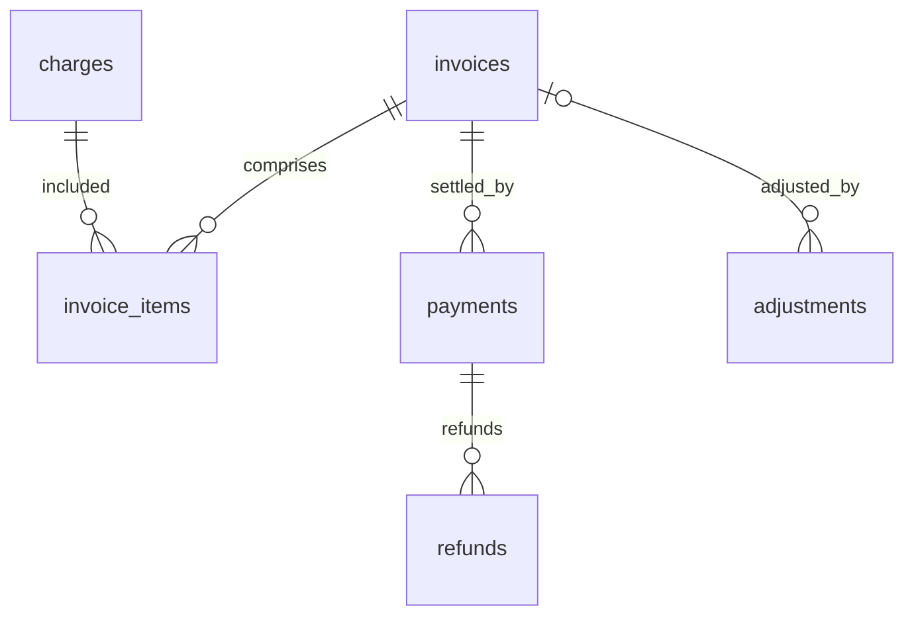

# DATABASE_DESIGN.md

# Enterprise Hospital Operating System (EHOS)

# Complete PostgreSQL Database Design

**Version:** 1.0.0
**Status:** Design Baseline
**Audience:** Database Engineers, Backend Engineers, Data Architects, Security, AI Engineers
**Relates to:** `EHOS_ARCHITECTURE_DESIGN.md` §6, `DATABASE_ARCHITECTURE.md`, `DATABASE_STANDARDS.md`

---

## 1. Purpose

This document is the complete, production-ready PostgreSQL database design for EHOS. It defines:

- Every database owned by every microservice (database-per-service).
- Every table with primary keys (PKs), foreign keys (FKs), indexes, and constraints.
- Audit columns, soft delete, versioning, and history tables for every business entity.
- The ER relationships across each domain.
- Naming rules, extensions, partitioning, encryption, retention, and forbidden practices.

**No APIs are defined here.** This is schema design only. APIs are implemented later per
`API_DESIGN_STANDARD.md`.

---

## 2. Global Conventions

### 2.1 Technology & Database-per-Service

- PostgreSQL 16+ is the single transactional store for every service.
- Each service owns exactly one database: `<service>_db` (prod), `<service>_dev`, `<service>_test`.
- **No service ever reads or writes another service's database.**
- Cross-service data is obtained through APIs or through **event-echoed, owned projections**
  (a consumer service materializes its own copies of foreign identifiers it needs).
- Redis: cache/session/rate-limit (not persisted domain truth). Qdrant: vectors. MinIO: files/DICOM.
- The `audit_db` is read-only for all services except the `audit-service`.

### 2.2 Database List (owned by service)

| Database | Owning service | Domain |
|---|---|---|
| `audit_db` | audit-service | Immutable, append-only audit + event store |
| `notification_db` | notification-service | Templates, sent notifications/schedule |
| `configuration_db` | configuration-service | Feature flags, reference config, code tables |
| `identity_db` | identity-service | User lifecycle mirror of Keycloak |
| `patient_db` | patient-service | Patient master, MPI, consents, contacts |
| `scheduling_db` | appointment-service + queue-service | Appointments, schedules, queues |
| `ehr_db` | ehr-service | Encounters, diagnoses, notes, treatments, vital signs |
| `documentation_db` | clinical-documentation-service | Document registry, approvals, versions |
| `prescription_db` | prescription-service | Prescriptions, medication orders, allergy checks |
| `pharmacy_db` | pharmacy-service | Medication catalog, dispensing, controlled drugs |
| `laboratory_db` | laboratory-service | Orders, samples, results, verification |
| `radiology_db` | radiology-service | Imaging requests, studies, reports, DICOM refs |
| `emergency_db` | emergency-service | ED registration, triage, ED flow |
| `surgery_db` | surgery-service | Surgical scheduling, teams, perioperative |
| `bed_db` | bed-service | Beds, occupancy, requests, transfers |
| `telemedicine_db` | telemedicine-service | Telehealth sessions, remote monitoring |
| `workflow_db` | workflow-service | Workflow definitions, instances, transitions |
| `billing_db` | billing-service | Charges, invoices, payments, receipts, refunds |
| `insurance_db` | insurance-service | Policies, coverage, claims, authorizations |
| `finance_db` | finance-service | GL, journals, accounts, cost centers |
| `inventory_db` | inventory-service | Items, stock, movements, expiry, batches |
| `procurement_db` | procurement-service | Suppliers, POs, requisitions, receipts |
| `hr_db` | hr-service | Employees, credentials, shifts, attendance |
| `payroll_db` | payroll-service | Payroll runs, inputs, payslips |
| `reporting_db` | reporting-service | Report defs, runs, exports, dashboards |
| `ai_db` | ai-gateway + ai-family | Models, agents, prompts, requests, human approval |
| `knowledge_db` | knowledge-service | Documents, chunks, embeddings metadata |
| `analytics_db` (warehouse) | analytics | Star schemas, aggregates (separate doc) |

### 2.3 Naming Rules

| Item | Rule | Example |
|---|---|---|
| Database | `snake_case` | `patient_db`, `patient_prod` |
| Schema | per-service schema name = service | `patient`, `billing` |
| Table | plural `snake_case` | `patients`, `stock_movements` |
| Column | singular `snake_case` | `first_name`, `date_of_birth` |
| FK column | `<singular_entity>_id` | `patient_id` |
| History table | `<table>_history` | `patients_history` |
| Outbox | `outbox_events` (every DB) | — |
| Index | `idx_<table>_<cols>` | `idx_appointments_patient_status` |
| Unique | `uq_<table>_<cols>` | `uq_patients_mrn` |
| Check | `chk_<table>_<col>` | `chk_invoices_amount_positive` |
| Sequence | `seq_<table>` | `seq_beds_number` |

### 2.4 Extension Bootstrap (every database)

```sql
CREATE EXTENSION IF NOT EXISTS pgcrypto;      -- gen_random_uuid()
CREATE EXTENSION IF NOT EXISTS pg_trgm;       -- fuzzy search on names
-- Optional per database:
-- CREATE EXTENSION IF NOT EXISTS pg_partman;  -- automated partitioning
-- CREATE EXTENSION IF NOT EXISTS timescaledb; -- vitals/time-series only (avoid unless justified)
```

### 2.5 The Common Row Block (every business table)

```sql
id                 UUID PRIMARY KEY DEFAULT gen_random_uuid(),
-- entity-specific columns ...

-- audit columns (mandatory on every table, including history tables' *_history)
created_at         TIMESTAMPTZ NOT NULL DEFAULT now(),
updated_at         TIMESTAMPTZ NOT NULL DEFAULT now(),
created_by         UUID,            -- user principal id (from JWT `sub`)
updated_by         UUID,
version            INT NOT NULL DEFAULT 1,          -- optimistic locking
status             TEXT NOT NULL,                   -- entity lifecycle; check-constrained per table
audit_reference    TEXT,                            -- correlation_id from request header

-- soft delete (mandatory on every business table; clinical/financial data is never hard-deleted)
deleted_at         TIMESTAMPTZ,
deleted_by         UUID,
deletion_reason    TEXT
```

Postgres 15+ alternative: `SHARED DEFAULTS` via a function is avoided; the columns are explicit so DDL is readable.

### 2.6 Soft Delete Rules

- `deleted_at IS NOT NULL` ⇒ row is logically deleted; APIs must filter `deleted_at IS NULL`.
- **Clinical (ehr, prescription, pharmacy, laboratory, radiology, emergency) and financial
  (billing, finance, insurance) records are NEVER hard-deleted and deletions require a reason.**
- Reference/data tables (code tables, templates) may be hard-removed only via migration with an
  audit record; standard path is soft delete + status=`INACTIVE`.
- Deletion itself is audited: the `audit-service` receives an event and an audit record is inserted.
- Partial indexes for delete-filtered queries: `CREATE INDEX ... WHERE deleted_at IS NULL`.

### 2.7 Versioning & History Tables

Two mechanisms, used together:

1. **Optimistic locking:** `version INT` incremented on every UPDATE. CAS writes:
   `UPDATE ... SET version = version + 1 WHERE id = $1 AND version = $2`.

2. **History tables:** every business table has `<table>_history`. A row is appended on INSERT,
   UPDATE, and DELETE via a trigger function. This gives immutable clinical history at the DB layer
   in addition to application-level `_versions`.

History table shape (all times & identity are shared so they cannot diverge):
```sql
CREATE TABLE IF NOT EXISTS patients_history (
    history_id   BIGINT GENERATED ALWAYS AS IDENTITY PRIMARY KEY,
    op           TEXT NOT NULL CHECK (op IN ('INSERT','UPDATE','DELETE')),
    row_id       UUID NOT NULL,            -- the source patients.id
    entity_version INT NOT NULL,
    old_row      JSONB,
    new_row      JSONB,
    changed_by   UUID,
    changed_at   TIMESTAMPTZ NOT NULL DEFAULT now(),
    audit_reference TEXT
);
-- index for fast lookup of row lineage
-- CREATE INDEX idx_patients_history_row ON patients_history (row_id, entity_version);
```

Trigger machinery (defined once per database, reused by all tables):
```sql
CREATE OR REPLACE FUNCTION fn_write_history()
RETURNS TRIGGER AS $$
DECLARE
    v_old JSONB; v_new JSONB;
BEGIN
    IF (TG_OP = 'DELETE') THEN
        v_old := to_jsonb(OLD);
        INSERT INTO history_<tg rows> ...
        RETURN OLD;
    END IF;
    -- generic implementation uses dynamic table name via TG_TABLE_NAME
END $$ LANGUAGE plpgsql;
```

*(Full DDL for the generic trigger is provided in `database/<db>/10_history.sql` at implementation time.)*

### 2.8 Index Rules

- Every FK column gets an index (Postgres does not auto-index FKs).
- Composite indexes follow the query patterns in the endpoint catalog (§4.3 of architecture).
- Leading column should be the equality column; range columns last.
- `pg_trgm` GIN index on name/free-text columns that are searched (`first_name`, `last_name`).
- Partial `WHERE deleted_at IS NULL` on hot lookups (unique indexes on soft-deleted tables MUST be partial).
- Big time-based tables partition by month (patients_history, audit_logs, events, stock_movements,
  lab_results, payments).

### 2.9 Partitioning Strategy

- Partition key chosen: `RANGE BY created_at` (or `occurred_at`) MONTHLY.
- Parent table = partitioned; child partitions `p2026_08`, `p2026_09`...
- Queries always filter by the partition key; application layer supplies date bounds.
- `pg_partman` is preferred for management in prod.

### 2.10 JSONB / Flexible Fields

- `attributes JSONB` for extension points only; never for primary structured data.
- `contact_info JSONB`, `consent_metadata JSONB` allowed on `patients` per standards doc.
- Never index the whole JSONB unless using GIN for containment queries; prefer generated columns
  (`name LIKE` patterns) or normalized child tables.

### 2.11 Encryption & Row-Level Security

- Column-level AES-256 (pgcrypto) for: `national_identifier`, `insurance_number`, `ssn`-type fields.
- **RLS (ROW LEVEL SECURITY) ON** for `patients`, `patient_identifiers`, `patient_consents`,
  `clinical_notes`, `diagnoses`, `treatments`, `prescriptions`, `lab_results`, `radiology_reports`,
  `payments`. Policies grant select/insert by role + facility scope and enforce
  `deleted_at IS NULL`.
- DB accounts: one app role per service with `GRANT` limited to its schema; DDL role separate.

---

## 3. Data Model Relationships (ER Overview)

```
                          ┌──────────────┐                    ┌────────────────┐
                          │   patients    │                    │   employees    │
                          │  (patient_db) │                    │    (hr_db)     │
                          └──────┬───────┘                    └───────┬────────┘
                                 │                                    │
                 ┌───────────────┼───────────────┐          ┌──────────┼──────────┐
                 │               │               │          │          │          │
                 ▼               ▼               ▼          ▼          ▼          ▼
         appointments    encounters       billing      shifts     payroll       users/roles
        (scheduling_db)   (ehr_db)       (billing_db)            (payroll_db)  (keycloak)
                 │               │
                 │               ├──────────┬───────────┬───────────┬───────────┐
                 │               ▼          ▼           ▼           ▼           ▼
                 │         clinical_notes diagnoses treatments   lab_orders  imaging_requests
                 │                                                          (radiology_db)
                 ▼
               queues (scheduling_db)       prescriptions → pharmacy dispensing
                                          lab_results → inventories → procurement
```

**Canonical ownership rule:** FKs point to the owning service's database. A service that needs a
foreign entity id (e.g., scheduling needs `patient_id`) stores it as a scalar column plus a verified
`patient_ref` snapshot and the id is validated at the API boundary — **no cross-database FK**.

Example of the projection pattern used across all databases:

```sql
-- scheduling_db.appointments
patient_id    UUID NOT NULL,          -- from patient-service (no FK: different DB)
patient       JSONB,                  -- projection/snapshot (name, mrn, dob) maintained by events
```

---

## 4. Platform Databases

### 4.1 `audit_db` (audit-service)

Append-only, tamper-evident. All other services publish events; audit inserts immutable records.
Tables:

| Table | Purpose |
|---|---|
| `audit_logs` | Immutable per-action records, hash-chained |
| `audit_log_entries` | Child details per log (optional extensibility) |
| `events` | Event store (every domain event published) |
| `event_sagas` | Saga/transaction tracking across services |
| `integrity_verifications` | Scheduled hash-chain verification results |
| `audit_archives` | Frozen archives partitioned by year |

**`audit_logs`** — critical security table
```sql
CREATE TABLE audit_logs (
    id               UUID PRIMARY KEY DEFAULT gen_random_uuid(),
    event_id         UUID NOT NULL,           -- from event envelope
    correlation_id   TEXT,
    user_id          UUID,
    service          TEXT NOT NULL,
    action           TEXT NOT NULL,           -- CREATE/UPDATE/DELETE/APPROVE/...
    resource_type    TEXT NOT NULL,           -- 'patient','prescription',...
    resource_id      UUID,
    old_value        JSONB,
    new_value        JSONB,
    ip_address       INET,
    user_agent       TEXT,
    occurred_at      TIMESTAMPTZ NOT NULL DEFAULT now(),
    -- hash chain for tamper evidence
    prev_hash        TEXT,
    payload_hash     TEXT NOT NULL,
    chain_hash       TEXT NOT NULL
);
-- index: by service+time (partitioned monthly)
-- index: by user_id, by resource_type+resource_id, by correlation_id
-- partial unique: uq_audit_event_id WHERE event_id IS NOT NULL
```

**`events`** — event store
```sql
CREATE TABLE events (
    id            UUID PRIMARY KEY DEFAULT gen_random_uuid(),
    event_id      UUID NOT NULL,
    event_type    TEXT NOT NULL,          -- 'PatientRegistered', ...
    event_version INT NOT NULL DEFAULT 1,
    source        TEXT NOT NULL,
    correlation_id TEXT,
    user_id       UUID,
    payload       JSONB NOT NULL,
    occurred_at   TIMESTAMPTZ NOT NULL DEFAULT now(),
    status        TEXT NOT NULL DEFAULT 'RECEIVED' CHECK (status IN ('RECEIVED','PROCESSED','FAILED','SKIPPED')),
    processed_at  TIMESTAMPTZ,
    UNIQUE (event_id)
)
PARTITION BY RANGE (occurred_at);
```

### 4.2 `notification_db` (notification-service)

```sql
CREATE TABLE notification_templates (
    id          UUID PRIMARY KEY DEFAULT gen_random_uuid(),
    code        TEXT NOT NULL,            -- 'appointment_reminder', ...
    channel     TEXT NOT NULL CHECK (channel IN ('EMAIL','SMS','PUSH','IN_APP')),
    locale      TEXT NOT NULL DEFAULT 'en',
    subject     TEXT,
    body        TEXT NOT NULL,
    vars_schema JSONB,                    -- expected variable names
    is_active   BOOLEAN NOT NULL DEFAULT true,
    -- common block (audit + soft delete)
    created_at TIMESTAMPTZ NOT NULL DEFAULT now(), updated_at TIMESTAMPTZ NOT NULL DEFAULT now(),
    created_by UUID, updated_by UUID, version INT NOT NULL DEFAULT 1, status TEXT NOT NULL DEFAULT 'ACTIVE',
    audit_reference TEXT, deleted_at TIMESTAMPTZ, deleted_by UUID, deletion_reason TEXT,
    UNIQUE (code, channel, locale)
);

CREATE TABLE notifications (
    id               UUID PRIMARY KEY DEFAULT gen_random_uuid(),
    template_id      UUID REFERENCES notification_templates(id),
    recipient_user_id UUID,
    recipient_email  TEXT,
    recipient_phone  TEXT,
    channel          TEXT NOT NULL,
    subject          TEXT,
    body             TEXT NOT NULL,
    payload          JSONB,
    status           TEXT NOT NULL DEFAULT 'PENDING'
                     CHECK (status IN ('PENDING','SENT','DELIVERED','FAILED','CANCELLED')),
    send_after       TIMESTAMPTZ,
    sent_at          TIMESTAMPTZ,
    delivered_at     TIMESTAMPTZ,
    attempts         INT NOT NULL DEFAULT 0,
    last_error       TEXT,
    provider_ref     TEXT,
    -- common block + soft delete
    ...
);

CREATE TABLE notification_recipients (         -- many recipients per notification
    id              UUID PRIMARY KEY DEFAULT gen_random_uuid(),
    notification_id UUID NOT NULL REFERENCES notifications(id),
    recipient_type  TEXT NOT NULL CHECK (recipient_type IN ('USER','EMAIL','PHONE','DEVICE')),
    recipient_value TEXT NOT NULL,
    channel         TEXT NOT NULL,
    status          TEXT NOT NULL DEFAULT 'PENDING',
    delivered_at    TIMESTAMPTZ,
    ...
);
```
History tables: `notification_templates_history`, `notifications_history`. Outbox: `outbox_events`.

### 4.3 `configuration_db` (configuration-service)

```sql
CREATE TABLE feature_flags (
    id          UUID PRIMARY KEY DEFAULT gen_random_uuid(),
    name        TEXT NOT NULL,
    namespace   TEXT NOT NULL DEFAULT 'default',   -- 'ehr','billing',...
    enabled     BOOLEAN NOT NULL DEFAULT false,
    rules       JSONB,                             -- audience rules
    start_at    TIMESTAMPTZ,
    end_at      TIMESTAMPTZ,
    notes       TEXT,
    -- common block + soft delete
    ..., UNIQUE (namespace, name)
);

CREATE TABLE configuration_entries (
    id          UUID PRIMARY KEY DEFAULT gen_random_uuid(),
    service     TEXT NOT NULL,
    key         TEXT NOT NULL,
    value_json  JSONB NOT NULL,
    value_type  TEXT NOT NULL CHECK (value_type IN ('STRING','INT','BOOL','JSON','SECRET')),
    environment TEXT NOT NULL DEFAULT 'production'
                CHECK (environment IN ('development','test','staging','production')),
    version     INT NOT NULL DEFAULT 1,
    -- common block + soft delete
    ..., UNIQUE (service, key, environment)
);
```
History + outbox included. Publishing `ConfigurationUpdated` triggers the event outbox.

### 4.4 `identity_db` (identity-service)

Mirror of Keycloak state for read-side and to seed events. Keycloak remains the identity source of
truth.
```sql
CREATE TABLE users (
    id             UUID PRIMARY KEY,             -- maps to Keycloak sub
    username       TEXT NOT NULL,
    email          TEXT NOT NULL,
    email_verified BOOLEAN NOT NULL DEFAULT false,
    full_name      TEXT,
    given_name     TEXT,
    family_name    TEXT,
    preferred_locale TEXT DEFAULT 'en',
    enabled        BOOLEAN NOT NULL DEFAULT true,
    last_login_at  TIMESTAMPTZ,
    attributes     JSONB,
    -- common block + soft delete
    ..., UNIQUE (username), UNIQUE (email)
);

CREATE TABLE user_mfa (
    id         UUID PRIMARY KEY DEFAULT gen_random_uuid(),
    user_id    UUID NOT NULL REFERENCES users(id),
    method     TEXT NOT NULL CHECK (method IN ('TOTP','SMS','EMAIL','WEBAUTHN')),
    secret_ref TEXT,                                -- not the secret itself
    enabled    BOOLEAN NOT NULL DEFAULT true,
    last_used_at TIMESTAMPTZ,
    -- common block + soft delete
    ...
);

CREATE TABLE user_sessions (
    id             UUID PRIMARY KEY DEFAULT gen_random_uuid(),
    user_id        UUID NOT NULL REFERENCES users(id),
    refresh_token_id UUID,
    client_id      TEXT NOT NULL,
    ip_address     INET,
    started_at     TIMESTAMPTZ NOT NULL DEFAULT now(),
    last_seen_at   TIMESTAMPTZ,
    ended_at       TIMESTAMPTZ,
    revoked        BOOLEAN NOT NULL DEFAULT false,
    -- common block
    ...
);
```

---

## 5. Patient & Scheduling

### 5.1 `patient_db` (patient-service)

**`patients`** — the master patient entity
```sql
CREATE TABLE patients (
    id                     UUID PRIMARY KEY DEFAULT gen_random_uuid(),
    patient_number         TEXT,                                  -- local MRN
    mrn                    TEXT,                                  -- master MRN for MPI
    first_name             TEXT NOT NULL,
    last_name              TEXT NOT NULL,
    other_names            TEXT,
    date_of_birth          DATE,
    gender                 TEXT CHECK (gender IN ('MALE','FEMALE','OTHER','UNDISCLOSED')),
    blood_group            TEXT CHECK (blood_group IN ('A+','A-','B+','B-','AB+','AB-','O+','O-')),
    nationality            TEXT,
    marital_status         TEXT,
    language_pref          TEXT DEFAULT 'en',
    national_identifier    TEXT,                                 -- encrypted via pgp/pgcrypto
    contact_info           JSONB,                                -- phones, emails
    address                JSONB,                                -- structured address
    emergency_contact      JSONB,
    registration_date      DATE NOT NULL DEFAULT CURRENT_DATE,
    consent_summary        JSONB,                                -- derived quick-view
    deceased_at            TIMESTAMPTZ,
    -- common block + soft delete
    ..., 
    UNIQUE (mrn) WHERE mrn IS NOT NULL,
    UNIQUE (patient_number) WHERE patient_number IS NOT NULL
);
CREATE INDEX idx_patients_name_trgm ON patients USING gin (first_name gin_trgm_ops, last_name gin_trgm_ops);
CREATE INDEX idx_patients_dob ON patients (date_of_birth) WHERE deleted_at IS NULL;
CREATE INDEX idx_patients_mrn_trgm ON patients USING gin (mrn gin_trgm_ops);
```

**`patient_identifiers`** — multi-issuer identifiers (NID, passport, insurance card, etc.)
```sql
CREATE TABLE patient_identifiers (
    id               UUID PRIMARY KEY DEFAULT gen_random_uuid(),
    patient_id       UUID NOT NULL REFERENCES patients(id),
    identifier_type  TEXT NOT NULL,               -- 'NATIONAL_ID','PASSPORT','INSURANCE','HOSPITAL'
    identifier_value TEXT NOT NULL,
    issuer           TEXT,
    valid_from       DATE,
    valid_to         DATE,
    is_primary       BOOLEAN NOT NULL DEFAULT false,
    encrypted_value  BYTEA,                        -- high sensitivity stored encrypted
    -- common block + soft delete
    ..., UNIQUE (identifier_type, issuer, identifier_value)
);
```

**`patient_contacts`** / **`patient_addresses`** — child tables
```sql
CREATE TABLE patient_contacts (
    id            UUID PRIMARY KEY DEFAULT gen_random_uuid(),
    patient_id    UUID NOT NULL REFERENCES patients(id),
    contact_type  TEXT NOT NULL CHECK (contact_type IN ('PHONE','EMAIL','WHATSAPP','EMERGENCY')),
    value         TEXT NOT NULL,
    is_primary    BOOLEAN NOT NULL DEFAULT false,
    is_verified   BOOLEAN NOT NULL DEFAULT false,
    -- common block + soft delete
    ..., UNIQUE (patient_id, contact_type, value)
);
```

**`patient_consents`** — consents source of truth
```sql
CREATE TABLE patient_consents (
    id               UUID PRIMARY KEY DEFAULT gen_random_uuid(),
    patient_id       UUID NOT NULL REFERENCES patients(id),
    consent_type     TEXT NOT NULL
                     CHECK (consent_type IN ('TREATMENT','DATA_SHARING','RESEARCH','TELEHEALTH','AUTOMATION')),
    granted          BOOLEAN NOT NULL,
    date_given       DATE NOT NULL DEFAULT CURRENT_DATE,
    expiry_date      DATE,
    documentation_ref TEXT,               -- signed form or recording ref
    withdrawn_at     TIMESTAMPTZ,
    withdrawn_by     UUID,
    revoked_reason   TEXT,
    -- common block + soft delete
    ...
);
-- audit flags on grant/withdraw are surfaced via audit_db events (ConsentChanged)
```

**`patient_visits_summary`** — owned projection materialized from scheduling/ehr events (read-only
to patient-service consumers that need it; not used for truth).

**MPI:** `patient_links` for record linkage across facilities.
```sql
CREATE TABLE patient_links (
    id              UUID PRIMARY KEY DEFAULT gen_random_uuid(),
    left_patient_id UUID NOT NULL REFERENCES patients(id),
    right_patient_id UUID NOT NULL REFERENCES patients(id),
    match_score     NUMERIC(5,4),
    match_method    TEXT,                -- 'ALGORITHM','MANUAL','AUTO_APPROVED'
    link_type       TEXT NOT NULL CHECK (link_type IN ('SAME_PERSON','DUPLICATE','RELATED')),
    resolved_by     UUID,
    resolved_at     TIMESTAMPTZ,
    -- common block + soft delete
    ..., CHECK (left_patient_id <> right_patient_id)
);
```

History tables: `patients_history`, `patient_identifiers_history`, `patient_consents_history`,
`patient_contacts_history`, `patient_links_history`. Outbox for `PatientRegistered/Updated/Merged`.

### 5.2 `scheduling_db` (appointment-service + queue-service)

**`appointments`**
```sql
CREATE TABLE appointments (
    id            UUID PRIMARY KEY DEFAULT gen_random_uuid(),
    patient_id    UUID NOT NULL,                 -- cross-db ref to patient-service (no FK)
    patient_snapshot JSONB,                      -- projection kept fresh by events
    provider_id   UUID,                          -- ref to hr_db employee
    department_id UUID,                          -- ref to deposit for hr
    appointment_type TEXT NOT NULL,              -- 'OUTPATIENT','FOLLOWUP','PROCEDURE','TELEHEALTH'
    start_time    TIMESTAMPTZ NOT NULL,
    end_time      TIMESTAMPTZ,
    duration_min  INT,
    status        TEXT NOT NULL DEFAULT 'SCHEDULED'
                  CHECK (status IN ('SCHEDULED','ARRIVED','IN_PROGRESS','COMPLETED','CANCELLED','NO_SHOW','REQUESTED','RESCHEDULED')),
    reason        TEXT,
    priority      TEXT NOT NULL DEFAULT 'ROUTINE' CHECK (priority IN ('ROUTINE','URGENT','EMERGENCY')),
    source        TEXT DEFAULT 'MANUAL' CHECK (source IN ('MANUAL','PORTAL','CALL','KIOSK','AI')),
    consultation_room TEXT,
    cancellation_reason TEXT,
    cancelled_by  UUID,
    cancelled_at  TIMESTAMPTZ,
    rescheduleSource UUID,                       -- the previous appointment when rescheduled
    -- common block + soft delete
    ...
);
CREATE INDEX idx_appointments_patient_status ON appointments (patient_id, status) WHERE deleted_at IS NULL;
CREATE INDEX idx_appointments_provider_time ON appointments (provider_id, start_time) WHERE deleted_at IS NULL;
CREATE INDEX idx_appointments_department_time ON appointments (department_id, start_time) WHERE deleted_at IS NULL;
```

**`schedules`** (provider availability)
```sql
CREATE TABLE schedules (
    id            UUID PRIMARY KEY DEFAULT gen_random_uuid(),
    provider_id   UUID NOT NULL,
    department_id UUID,
    slot_type     TEXT NOT NULL CHECK (slot_type IN ('CLINIC','SURGERY','ROUNDS','TELEHEALTH')),
    recur_rule    TEXT,                          -- RRULE
    starts_on     DATE NOT NULL,
    ends_on       DATE,
    weekdays      SMALLINT[],                    -- [1..7] days
    is_active     BOOLEAN NOT NULL DEFAULT true,
    -- common block + soft delete
    ...
);

CREATE TABLE schedule_slots (
    id            UUID PRIMARY KEY DEFAULT gen_random_uuid(),
    schedule_id   UUID NOT NULL REFERENCES schedules(id),
    slot_start    TIMESTAMPTZ NOT NULL,
    slot_end      TIMESTAMPTZ NOT NULL,
    status        TEXT NOT NULL DEFAULT 'FREE' CHECK (status IN ('FREE','BLOCKED','BOOKED','CANCELLED')),
    appointment_id UUID REFERENCES appointments(id),
    -- common block + soft delete
    ..., UNIQUE (schedule_id, slot_start)
);
```

**`queues`** and **`queue_entries`**
```sql
CREATE TABLE queues (
    id            UUID PRIMARY KEY DEFAULT gen_random_uuid(),
    queue_type    TEXT NOT NULL CHECK (queue_type IN ('OUTPATIENT','EMERGENCY','LAB','PHARMACY','ADMISSION','RADIOLOGY')),
    department_id UUID,
    name          TEXT,
    is_active     BOOLEAN NOT NULL DEFAULT true,
    -- common block + soft delete
    ...
);

CREATE TABLE queue_entries (
    id            UUID PRIMARY KEY DEFAULT gen_random_uuid(),
    queue_id      UUID NOT NULL REFERENCES queues(id),
    patient_id    UUID NOT NULL,
    patient_snapshot JSONB,
    ticket_number TEXT NOT NULL,
    priority      INT NOT NULL DEFAULT 0,        -- lower = higher priority
    status        TEXT NOT NULL DEFAULT 'WAITING'
                  CHECK (status IN ('WAITING','CALLED','IN_PROGRESS','COMPLETED','SKIPPED','CANCELLED')),
    joined_at     TIMESTAMPTZ NOT NULL DEFAULT now(),
    called_at     TIMESTAMPTZ,
    started_at    TIMESTAMPTZ,
    completed_at  TIMESTAMPTZ,
    served_by     UUID,
    wait_time_min INT,
    -- common block + soft delete
    ..., UNIQUE (queue_id, ticket_number)
);
```

### 5.3 ER diagram — patient & scheduling



---

## 6. Clinical Databases

### 6.1 `ehr_db` (ehr-service)

**`encounters`**
```sql
CREATE TABLE encounters (
    id              UUID PRIMARY KEY DEFAULT gen_random_uuid(),
    patient_id      UUID NOT NULL,               -- cross-db ref
    patient_snapshot JSONB,
    encounter_type  TEXT NOT NULL CHECK (encounter_type IN ('OUTPATIENT','INPATIENT','ED','SURGERY','TELEHEALTH','HOME')),
    department_id   UUID,                        -- cross-db ref hr
    provider_id     UUID,                        -- cross-db ref hr
    start_time      TIMESTAMPTZ NOT NULL,
    end_time        TIMESTAMPTZ,
    admission_id    UUID,                        -- cross-ref to bed_db
    visit_number    TEXT,
    reason          TEXT,
    status          TEXT NOT NULL DEFAULT 'OPEN'
                    CHECK (status IN ('PLANNED','OPEN','IN_PROGRESS','CLOSED','CANCELLED')),
    billing_lock    BOOLEAN NOT NULL DEFAULT false,
    -- common block + soft delete
    ...
);
CREATE INDEX idx_encounters_patient ON encounters (patient_id, start_time DESC) WHERE deleted_at IS NULL;
CREATE INDEX idx_encounters_provider_time ON encounters (provider_id, start_time) WHERE deleted_at IS NULL;
```

**`clinical_notes`** — immutable versioning (SOAP/progress/discharge)
```sql
CREATE TABLE clinical_notes (
    id             UUID PRIMARY KEY DEFAULT gen_random_uuid(),
    encounter_id   UUID REFERENCES encounters(id),
    patient_id     UUID NOT NULL,
    author_id      UUID NOT NULL,                -- hr/user
    author_role    TEXT,
    note_type      TEXT NOT NULL CHECK (note_type IN ('SOAP','PROGRESS','ADMISSION','DISCHARGE','CONSULT','NURSING','OPNOTE','AI_DRAFT')),
    content        TEXT NOT NULL,                -- final approved content (markdown/FHIR narrative)
    content_struct JSONB,                        -- structured sections
    approval_status TEXT NOT NULL DEFAULT 'DRAFT'
                    CHECK (approval_status IN ('DRAFT','PENDING_REVIEW','APPROVED','SIGNED','REJECTED','RETRACTED')),
    approved_by    UUID,
    approved_at    TIMESTAMPTZ,
    signed_by      UUID,
    signed_at      TIMESTAMPTZ,
    source         TEXT CHECK (source IN ('MANUAL','AI_DRAFT','VOICE','IMPORTED')),
    ai_draft_ref   UUID,                         -- optional link to ai request if drafted by AI
    -- common block + soft delete
    ...
);
CREATE INDEX idx_clinical_notes_encounter ON clinical_notes (encounter_id);
CREATE INDEX idx_clinical_notes_patient_note ON clinical_notes (patient_id, note_type);
```

**Versioning of clinical entities — three explicit artifacts (never overwrite approved content):**

1. `clinical_notes_history` (DB trigger, see §2.7).
2. `clinical_note_versions` — application-level controlled revisions:
```sql
CREATE TABLE clinical_note_versions (
    id              UUID PRIMARY KEY DEFAULT gen_random_uuid(),
    note_id         UUID NOT NULL REFERENCES clinical_notes(id),
    version_no      INT NOT NULL,
    content         TEXT NOT NULL,
    content_struct  JSONB,
    author_id       UUID,
    change_reason   TEXT,
    created_at      TIMESTAMPTZ NOT NULL DEFAULT now(),
    UNIQUE (note_id, version_no)
);
```
3. `clinical_note_amendments` — formal addenda without rewriting:
```sql
CREATE TABLE clinical_note_amendments (
    id          UUID PRIMARY KEY DEFAULT gen_random_uuid(),
    note_id     UUID NOT NULL REFERENCES clinical_notes(id),
    author_id   UUID NOT NULL,
    amendment   TEXT NOT NULL,
    added_at    TIMESTAMPTZ NOT NULL DEFAULT now(),
    audit_reference TEXT,
    -- common block + soft delete
    ...
);
```

**`diagnoses`**
```sql
CREATE TABLE diagnoses (
    id            UUID PRIMARY KEY DEFAULT gen_random_uuid(),
    encounter_id  UUID NOT NULL REFERENCES encounters(id),
    patient_id    UUID NOT NULL,
    diagnosis_code TEXT NOT NULL,            -- ICD-10 / ICD-11 (or SNOMED-CT for FHIR)
    code_system   TEXT NOT NULL DEFAULT 'ICD-10'
                  CHECK (code_system IN ('ICD-10','ICD-11','SNOMED-CT')),
    description   TEXT NOT NULL,
    type          TEXT NOT NULL DEFAULT 'WORKING'
                  CHECK (type IN ('WORKING','PROVISIONAL','FINAL','ADMISSION','DISCHARGE','DEATH')),
    onset_date    DATE,
    menopause_note TEXT,                      -- (placeholder for clinical notes)
    diagnosed_by  UUID NOT NULL,
    diagnosed_at  TIMESTAMPTZ NOT NULL DEFAULT now(),
    resolved_at   TIMESTAMPTZ,
    resolved_by   UUID,
    status        TEXT NOT NULL DEFAULT 'ACTIVE' CHECK (status IN ('ACTIVE','RESOLVED','REJECTED')),
    present_on_admission BOOLEAN,
    -- common block + soft delete
    ...
);
CREATE INDEX idx_diagnoses_patient ON diagnoses (patient_id);
CREATE INDEX idx_diagnoses_code ON diagnoses (diagnosis_code) WHERE deleted_at IS NULL;
```

**`treatments`**
```sql
CREATE TABLE treatments (
    id            UUID PRIMARY KEY DEFAULT gen_random_uuid(),
    patient_id    UUID NOT NULL,
    encounter_id  UUID REFERENCES encounters(id),
    treatment_type TEXT NOT NULL CHECK (treatment_type IN ('PROCEDURE','MEDICATION','THERAPY','SURGERY','CARE_PLAN','OTHER')),
    description   TEXT NOT NULL,
    provider_id   UUID,
    scheduled_at  TIMESTAMPTZ,
    performed_at  TIMESTAMPTZ,
    outcome       TEXT,
    complications TEXT,
    status        TEXT NOT NULL DEFAULT 'PLANNED' CHECK (status IN ('PLANNED','IN_PROGRESS','COMPLETED','CANCELLED','STOPPED')),
    -- common block + soft delete
    ...
);
```

**`vital_signs`** — observations / measurements
```sql
CREATE TABLE vital_signs (
    id            UUID PRIMARY KEY DEFAULT gen_random_uuid(),
    patient_id    UUID NOT NULL,
    encounter_id  UUID,
    recorded_at   TIMESTAMPTZ NOT NULL DEFAULT now(),
    recorded_by   UUID,
    vital_type    TEXT NOT NULL CHECK (vital_type IN ('BP','HR','RR','TEMP','SPO2','WEIGHT','HEIGHT','BMI','GLUCOSE','PAIN','GCS')),
    value_numeric NUMERIC,
    value_text    TEXT,
    unit          TEXT,
    notion        JSONB,                      -- nuances (position, cuff side)
    -- common block + soft delete
    ...
)
PARTITION BY RANGE (recorded_at);            -- monthly partitions
```

**`care_plans`**, **`care_plan_items`**, **`referrals`** follow the same pattern (uuid + common block).

ER — ehr domain:


### 6.2 `documentation_db` (clinical-documentation-service)

```sql
CREATE TABLE document_templates (
    id          UUID PRIMARY KEY DEFAULT gen_random_uuid(),
    code        TEXT NOT NULL,
    doc_type    TEXT NOT NULL CHECK (doc_type IN ('CONSENT','REPORT','CERTIFICATE','DISCHARGE_SUMMARY','REFERRAL','LETTER','AI_DRAFT')),
    title       TEXT NOT NULL,
    body_template TEXT NOT NULL,
    vars_schema JSONB,
    is_active   BOOLEAN NOT NULL DEFAULT true,
    -- common block + soft delete
    ..., UNIQUE (code)
);

CREATE TABLE documents (
    id             UUID PRIMARY KEY DEFAULT gen_random_uuid(),
    patient_id     UUID NOT NULL,                      -- cross-db
    encounter_id   UUID,
    doc_type       TEXT NOT NULL,
    template_id    UUID REFERENCES document_templates(id),
    title          TEXT,
    body           TEXT,
    status         TEXT NOT NULL DEFAULT 'DRAFT'
                   CHECK (status IN ('DRAFT','PENDING_APPROVAL','APPROVED','SIGNED','PUBLISHED','ARCHIVED','REJECTED')),
    author_id      UUID NOT NULL,
    approver_id    UUID,
    approved_at    TIMESTAMPTZ,
    signer_id      UUID,
    signed_at      TIMESTAMPTZ,
    ai_draft_ref   UUID,
    content_hash   TEXT,                               -- SHA-256 for integrity
    -- common block + soft delete
    ...
);

CREATE TABLE document_versions (
    id          UUID PRIMARY KEY DEFAULT gen_random_uuid(),
    document_id UUID NOT NULL REFERENCES documents(id),
    version_no  INT NOT NULL,
    body        TEXT NOT NULL,
    status      TEXT,
    changed_by  UUID,
    changed_at  TIMESTAMPTZ NOT NULL DEFAULT now(),
    UNIQUE (document_id, version_no)
);
```

### 6.3 `prescription_db` (prescription-service)

**`prescriptions`** — header (many medication lines)
```sql
CREATE TABLE prescriptions (
    id            UUID PRIMARY KEY DEFAULT gen_random_uuid(),
    patient_id    UUID NOT NULL,
    patient_snapshot JSONB,
    encounter_id  UUID,
    prescriber_id UUID NOT NULL,              -- hr ref
    issue_date    DATE NOT NULL DEFAULT CURRENT_DATE,
    therapy_type  TEXT CHECK (therapy_type IN ('ACUTE','CHRONIC','PRN','PROPHYLACTIC')),
    status        TEXT NOT NULL DEFAULT 'ACTIVE'
                  CHECK (status IN ('ACTIVE','PAUSED','COMPLETED','CANCELLED','EXPIRED')),
    allergy_checked BOOLEAN NOT NULL DEFAULT false,
    interaction_checked BOOLEAN NOT NULL DEFAULT false,
    start_date    DATE,
    end_date      DATE,
    repeat_instructions TEXT,
    reason        TEXT,
    cancelled_by  UUID,
    cancelled_at  TIMESTAMPTZ,
    cancellation_reason TEXT,
    -- common block + soft delete
    ...
);
```

**`prescription_items`** — one line per medication
```sql
CREATE TABLE prescription_items (
    id            UUID PRIMARY KEY DEFAULT gen_random_uuid(),
    prescription_id UUID NOT NULL REFERENCES prescriptions(id),
    medication_id UUID,                       -- pharma catalog ref (cross-db)
    medication    TEXT NOT NULL,              -- free text when no catalog entry
    dosage        TEXT NOT NULL,              -- e.g. '500 mg'
    frequency     TEXT NOT NULL,              -- '1-0-1'
    route         TEXT,                       -- 'ORAL','IV','IM','TOPICAL','INHALED'
    duration_days INT,
    quantity      NUMERIC,
    instructions  TEXT,
    max_per_day   NUMERIC,
    status        TEXT NOT NULL DEFAULT 'ACTIVE'
                  CHECK (status IN ('ACTIVE','PAUSED','COMPLETED','CANCELLED','DISCONTINUED')),
    -- common block + soft delete
    ...
);
CREATE INDEX idx_rx_items_prescription ON prescription_items (prescription_id);
```

**`medication_administration`** — critical clinical record (per EHOS doc §19)
```sql
CREATE TABLE medication_administration (
    id             UUID PRIMARY KEY DEFAULT gen_random_uuid(),
    patient_id     UUID NOT NULL,
    prescription_id UUID,
    prescription_item_id UUID REFERENCES prescription_items(id),
    medication_id  UUID,
    medication     TEXT NOT NULL,
    dose           TEXT NOT NULL,
    route          TEXT,
    administered_by UUID NOT NULL,
    administered_at TIMESTAMPTZ NOT NULL,
    documented_at  TIMESTAMPTZ NOT NULL DEFAULT now(),
    batch_number   TEXT,
    notes          TEXT,
    status         TEXT NOT NULL DEFAULT 'GIVEN' CHECK (status IN ('GIVEN','REFUSED','MISSED','PARTIAL','HELD')),
    reason_not_given TEXT,
    witness_id     UUID,                       -- 2-person check for controlled/IV
    -- common block + soft delete
    ...
);
CREATE INDEX idx_med_admin_patient ON medication_administration (patient_id, administered_at DESC);
```

**Allergy / interaction records**
```sql
CREATE TABLE patient_allergies (
    id           UUID PRIMARY KEY DEFAULT gen_random_uuid(),
    patient_id   UUID NOT NULL,
    allergen     TEXT NOT NULL,
    allergen_type TEXT CHECK (allergen_type IN ('DRUG','FOOD','ENVIRONMENT','OTHER')),
    severity     TEXT NOT NULL CHECK (severity IN ('MILD','MODERATE','SEVERE')),
    reaction     TEXT,
    recorded_by  UUID NOT NULL,
    recorded_at  TIMESTAMPTZ NOT NULL DEFAULT now(),
    confirmed    BOOLEAN NOT NULL DEFAULT false,
    -- common block + soft delete
    ..., UNIQUE (patient_id, allergen, allergen_type)
);
```
History: `prescriptions_history`, `prescription_items_history`,
`medication_administration_history`, `patient_allergies_history`. Outbox → pharmacy + pharmacist checks.

### 6.4 `pharmacy_db` (pharmacy-service)

**`medications`** — catalog
```sql
CREATE TABLE medications (
    id            UUID PRIMARY KEY DEFAULT gen_random_uuid(),
    code          TEXT NOT NULL,
    name          TEXT NOT NULL,
    generic_name  TEXT,
    manufacturer  TEXT,
    strength      TEXT,
    form          TEXT,                       -- 'TABLET','CAPSULE','SYRUP','INJECTION','OINTMENT'
    controlled    BOOLEAN NOT NULL DEFAULT false,
    atc_code      TEXT,
    attributes    JSONB,
    is_active     BOOLEAN NOT NULL DEFAULT true,
    -- common block + soft delete
    ..., UNIQUE (code)
);
CREATE INDEX idx_medications_name_trgm ON medications USING gin (name gin_trgm_ops);
```

**`stock`** (pharmacy inventory; shared semantics with inventory_db but owned here for medications)
```sql
CREATE TABLE stock_levels (
    id             UUID PRIMARY KEY DEFAULT gen_random_uuid(),
    medication_id  UUID NOT NULL REFERENCES medications(id),
    location       TEXT NOT NULL,
    quantity       NUMERIC NOT NULL DEFAULT 0 CHECK (quantity >= 0),
    reserved       NUMERIC NOT NULL DEFAULT 0,
    batch_number   TEXT,
    expiry_date    DATE,
    updated_at     TIMESTAMPTZ NOT NULL DEFAULT now(),
    -- common block + soft delete
    ..., UNIQUE (medication_id, location, batch_number)
);
```

**`dispensing_records`** — medication lifecycle
```sql
CREATE TABLE dispensing_records (
    id               UUID PRIMARY KEY DEFAULT gen_random_uuid(),
    patient_id       UUID NOT NULL,
    prescription_id  UUID,
    prescription_item_id UUID,
    medication_id    UUID NOT NULL REFERENCES medications(id),
    quantity         NUMERIC NOT NULL,
    dispensed_by     UUID NOT NULL,
    dispensed_at     TIMESTAMPTZ NOT NULL DEFAULT now(),
    batch_number     TEXT,
    price            NUMERIC(12,2),
    charge_id        UUID,                    -- cross-ref to billing after charge created
    notes            TEXT,
    status           TEXT NOT NULL DEFAULT 'DISPENSED'
                     CHECK (status IN ('PREPARED','DISPENSED','PICKED_UP','RETURNED','EXPIRED','SPOILED')),
    returned_at      TIMESTAMPTZ,
    returned_reason  TEXT,
    -- common block + soft delete
    ...
);
```

**`controlled_drug_log`** (drugs of addiction — 2-person witness mandatory)
```sql
CREATE TABLE controlled_drug_log (
    id                UUID PRIMARY KEY DEFAULT gen_random_uuid(),
    medication_id     UUID NOT NULL REFERENCES medications(id),
    batch_number      TEXT NOT NULL,
    action            TEXT NOT NULL CHECK (action IN ('RECEIVED','ISSUED','RETURNED','DISCARDED','COUNT')),
    quantity          NUMERIC NOT NULL,
    balance_after     NUMERIC NOT NULL,       -- running balance
    actor_id          UUID NOT NULL,
    witness_id        UUID NOT NULL,          -- 2-person rule
    occurred_at       TIMESTAMPTZ NOT NULL DEFAULT now(),
    balance_check     BOOLEAN NOT NULL DEFAULT false,
    notes             TEXT,
    -- common block + soft delete
    ...
);
```

ER — pharmacy:


### 6.5 `laboratory_db` (laboratory-service)

**`lab_tests`** — test catalog
```sql
CREATE TABLE lab_tests (
    id             UUID PRIMARY KEY DEFAULT gen_random_uuid(),
    code           TEXT NOT NULL,
    name           TEXT NOT NULL,
    category       TEXT NOT NULL,             -- 'HEMATOLOGY','BIOCHEMISTRY','MICROBIOLOGY','SEROLOGY','URINE'
    unit           TEXT,
    reference_low  NUMERIC,
    reference_high NUMERIC,
    specimen_type  TEXT,
    turnaround_min INT,
    is_active      BOOLEAN NOT NULL DEFAULT true,
    -- common block + soft delete
    ..., UNIQUE (code)
);
```

**`lab_orders`** + **`lab_order_items`**
```sql
CREATE TABLE lab_orders (
    id              UUID PRIMARY KEY DEFAULT gen_random_uuid(),
    patient_id      UUID NOT NULL,
    patient_snapshot JSONB,
    encounter_id    UUID,
    ordering_doctor UUID NOT NULL,
    priority        TEXT NOT NULL DEFAULT 'ROUTINE' CHECK (priority IN ('ROUTINE','URGENT','STAT')),
    ordered_at      TIMESTAMPTZ NOT NULL DEFAULT now(),
    clinical_notes  TEXT,
    status          TEXT NOT NULL DEFAULT 'ORDERED'
                    CHECK (status IN ('ORDERED','COLLECTED','IN_PROGRESS','RESULTED','VERIFIED','CANCELLED')),
    -- common block + soft delete
    ...
);
CREATE TABLE lab_order_items (
    id           UUID PRIMARY KEY DEFAULT gen_random_uuid(),
    lab_order_id UUID NOT NULL REFERENCES lab_orders(id),
    test_id      UUID REFERENCES lab_tests(id),
    test_name    TEXT NOT NULL,
    specimen_type TEXT,
    -- common block + soft delete
    ...
);
```

**`samples`** — collection + tracking
```sql
CREATE TABLE samples (
    id               UUID PRIMARY KEY DEFAULT gen_random_uuid(),
    lab_order_id     UUID NOT NULL REFERENCES lab_orders(id),
    patient_id       UUID NOT NULL,
    barcode          TEXT NOT NULL,
    sample_type      TEXT NOT NULL,          -- 'BLOOD','URINE','STOOL','TISSUE','CSF',...
    collection_time  TIMESTAMPTZ,
    collected_by     UUID,
    received_at      TIMESTAMPTZ,
    received_by      UUID,
    status           TEXT NOT NULL DEFAULT 'REQUESTED'
                     CHECK (status IN ('REQUESTED','COLLECTED','IN_TRANSIT','RECEIVED','ANALYZED','REJECTED','DISCARDED')),
    rejection_reason TEXT,
    -- common block + soft delete
    ..., UNIQUE (barcode)
);
```

**`lab_results`** — verified clinical data
```sql
CREATE TABLE lab_results (
    id               UUID PRIMARY KEY DEFAULT gen_random_uuid(),
    order_item_id    UUID NOT NULL REFERENCES lab_order_items(id),
    sample_id        UUID REFERENCES samples(id),
    patient_id       UUID NOT NULL,
    test_id          UUID REFERENCES lab_tests(id),
    test_name        TEXT NOT NULL,
    result_numeric   NUMERIC,
    result_text      TEXT,
    unit             TEXT,
    reference_range  TEXT,
    flag             TEXT CHECK (flag IN ('NORMAL','HIGH','LOW','CRITICAL','ABNORMAL')),
    performed_by     UUID,
    performed_at     TIMESTAMPTZ,
    verified_by      UUID,
    verified_at      TIMESTAMPTZ,
    status           TEXT NOT NULL DEFAULT 'PRELIMINARY'
                     CHECK (status IN ('PRELIMINARY','VERIFIED','AMENDED','CANCELLED')),
    instrumentation  TEXT,
    -- common block + soft delete
    ...
);
CREATE INDEX idx_lab_results_patient ON lab_results (patient_id, performed_at DESC) WHERE deleted_at IS NULL;
CREATE INDEX idx_lab_results_order ON lab_results (order_item_id);
```
History: `lab_results_history` critical for medico-legal chains. `samples_history` + `samples_events`.

### 6.6 `radiology_db` (radiology-service)

**`imaging_requests`**
```sql
CREATE TABLE imaging_requests (
    id              UUID PRIMARY KEY DEFAULT gen_random_uuid(),
    patient_id      UUID NOT NULL,
    patient_snapshot JSONB,
    encounter_id    UUID,
    ordering_doctor UUID NOT NULL,
    modality        TEXT NOT NULL CHECK (modality IN ('XRAY','CT','MRI','US','MAMMO','FLUORO','PET','NM')),
    body_part       TEXT,
    clinical_indication TEXT,
    priority        TEXT NOT NULL DEFAULT 'ROUTINE' CHECK (priority IN ('ROUTINE','URGENT','STAT')),
    status          TEXT NOT NULL DEFAULT 'REQUESTED'
                    CHECK (status IN ('REQUESTED','SCHEDULED','IN_PROGRESS','COMPLETED','REPORTED','CANCELLED')),
    ordered_at      TIMESTAMPTZ NOT NULL DEFAULT now(),
    -- common block + soft delete
    ...
);
```

**`studies`** / **`series`** (DICOM metadata; images live in MinIO)
```sql
CREATE TABLE studies (
    id               UUID PRIMARY KEY DEFAULT gen_random_uuid(),
    imaging_request_id UUID REFERENCES imaging_requests(id),
    patient_id       UUID NOT NULL,
    study_instance_uid TEXT NOT NULL,
    accession_number TEXT,
    modality         TEXT,
    started_at       TIMESTAMPTZ,
    ended_at         TIMESTAMPTZ,
    status           TEXT NOT NULL DEFAULT 'SCHEDULED' CHECK (status IN ('SCHEDULED','IN_PROGRESS','COMPLETED','ABORTED')),
    -- common block + soft delete
    ..., UNIQUE (study_instance_uid)
);

CREATE TABLE series (
    id               UUID PRIMARY KEY DEFAULT gen_random_uuid(),
    study_id         UUID NOT NULL REFERENCES studies(id),
    series_instance_uid TEXT NOT NULL,
    modality         TEXT,
    body_part        TEXT,
    images_count     INT,
    minio_bucket     TEXT,
    minio_prefix     TEXT,
    -- common block + soft delete
    ..., UNIQUE (series_instance_uid)
);
```

**`radiology_reports`** — findings + impression, immutable versioning
```sql
CREATE TABLE radiology_reports (
    id             UUID PRIMARY KEY DEFAULT gen_random_uuid(),
    study_id       UUID NOT NULL REFERENCES studies(id),
    patient_id     UUID NOT NULL,
    radiologist_id UUID,                       -- hr ref
    findings       TEXT,
    impression     TEXT,
    conclusion     TEXT,
    report_status  TEXT NOT NULL DEFAULT 'DRAFT'
                   CHECK (report_status IN ('DRAFT','PENDING_REVIEW','FINAL','AMENDED','SIGNED')),
    dictated       BOOLEAN NOT NULL DEFAULT false,
    ai_assist      BOOLEAN NOT NULL DEFAULT false,
    ai_draft_ref   UUID,
    signed_by      UUID,
    signed_at      TIMESTAMPTZ,
    -- common block + soft delete
    ...
);
CREATE TABLE radiology_report_versions (
    id          UUID PRIMARY KEY DEFAULT gen_random_uuid(),
    report_id   UUID NOT NULL REFERENCES radiology_reports(id),
    version_no  INT NOT NULL,
    findings    TEXT, impression TEXT, conclusion TEXT,
    report_status TEXT,
    changed_by  UUID,
    changed_at  TIMESTAMPTZ NOT NULL DEFAULT now(),
    UNIQUE (report_id, version_no)
);
```

### 6.7 `emergency_db` (emergency-service)

```sql
CREATE TABLE emergency_registrations (
    id              UUID PRIMARY KEY DEFAULT gen_random_uuid(),
    patient_id      UUID,                        -- optional for walk-ins
    patient_snapshot JSONB,
    registration_no TEXT NOT NULL,
    arrival_mode    TEXT CHECK (arrival_mode IN ('WALK_IN','AMBULANCE','TRANSFER','POLICE')),
    complaint       TEXT,
    registered_by   UUID NOT NULL,
    registered_at   TIMESTAMPTZ NOT NULL DEFAULT now(),
    status          TEXT NOT NULL DEFAULT 'REGISTERED'
                    CHECK (status IN ('REGISTERED','TRIAGED','IN_TREATMENT','ADMITTED','DISCHARGED','TRANSFERRED','DOA')),
    disposition     TEXT,
    -- common block + soft delete
    ...
);

CREATE TABLE triage_assessments (
    id              UUID PRIMARY KEY DEFAULT gen_random_uuid(),
    registration_id UUID NOT NULL REFERENCES emergency_registrations(id),
    patient_id      UUID,
    triage_level    INT NOT NULL CHECK (triage_level BETWEEN 1 AND 5),   -- 1 = Resuscitation, 5 = Non-urgent
    vitals          JSONB,
    chief_complaint TEXT,
    triaged_by      UUID NOT NULL,
    triaged_at      TIMESTAMPTZ NOT NULL DEFAULT now(),
    escalation_notified BOOLEAN NOT NULL DEFAULT false,
    -- common block + soft delete
    ...
);
CREATE INDEX idx_triage_active ON emergency_registrations (status) WHERE status IN ('REGISTERED','TRIAGED','IN_TREATMENT');
```

### 6.8 `surgery_db` (surgery-service)

```sql
CREATE TABLE surgeries (
    id               UUID PRIMARY KEY DEFAULT gen_random_uuid(),
    patient_id       UUID NOT NULL,
    surgeon_id       UUID NOT NULL,
    anesthesiologist_id UUID,
    encounter_id     UUID,
    theatre_id       UUID,
    procedure_code   TEXT,
    procedure_name   TEXT NOT NULL,
    complexity       TEXT CHECK (complexity IN ('MINOR','INTERMEDIATE','MAJOR','COMPLEX')),
    planned_start    TIMESTAMPTZ NOT NULL,
    planned_end      TIMESTAMPTZ,
    actual_start     TIMESTAMPTZ,
    actual_end       TIMESTAMPTZ,
    status           TEXT NOT NULL DEFAULT 'SCHEDULED'
                     CHECK (status IN ('SCHEDULED','ON_HOLD','PREOP','IN_PROGRESS','SUTURE','IN_RECOVERY','COMPLETED','CANCELLED')),
    cancellation_reason TEXT,
    urgency          TEXT NOT NULL DEFAULT 'ELECTIVE' CHECK (urgency IN ('ELECTIVE','URGENT','EMERGENCY')),
    -- common block + soft delete
    ...
);
CREATE INDEX idx_surgeries_surgeon_time ON surgeries (surgeon_id, planned_start) WHERE deleted_at IS NULL;
CREATE INDEX idx_surgeries_date ON surgeries (planned_start) WHERE deleted_at IS NULL;

CREATE TABLE surgery_team_members (
    id          UUID PRIMARY KEY DEFAULT gen_random_uuid(),
    surgery_id  UUID NOT NULL REFERENCES surgeries(id),
    member_id   UUID NOT NULL,                  -- hr ref
    role        TEXT NOT NULL CHECK (role IN ('SURGEON','ASSISTANT','ANESTHESIOLOGIST','NURSE','SCRUB','CIRCULATING')),
    -- common block + soft delete
    ...
);

CREATE TABLE perioperative_records (
    id          UUID PRIMARY KEY DEFAULT gen_random_uuid(),
    surgery_id  UUID NOT NULL REFERENCES surgeries(id),
    stage       TEXT NOT NULL,                  -- 'PREOP','INTRAOP','PACU'
    findings    TEXT,
    events      JSONB,
    recorded_by UUID NOT NULL,
    recorded_at TIMESTAMPTZ NOT NULL DEFAULT now(),
    -- common block + soft delete
    ...
);

CREATE TABLE surgery_checklists (
    id          UUID PRIMARY KEY DEFAULT gen_random_uuid(),
    surgery_id  UUID NOT NULL REFERENCES surgeries(id),
    check_type  TEXT NOT NULL CHECK (check_type IN ('TIME_OUT','SIGN_IN','SIGN_OUT')),
    item        TEXT NOT NULL,
    completed   BOOLEAN NOT NULL DEFAULT false,
    completed_by UUID,
    completed_at TIMESTAMPTZ,
    -- common block + soft delete
    ...
);
```

### 6.9 `bed_db` (bed-service)

```sql
CREATE TABLE wards (
    id            UUID PRIMARY KEY DEFAULT gen_random_uuid(),
    code          TEXT NOT NULL,
    name          TEXT NOT NULL,
    floor         TEXT,
    department_id UUID,
    ward_type     TEXT CHECK (ward_type IN ('GENERAL','ICU','CCU','PAEDS','MATERNITY','ISOLATION','SURGICAL')),
    beds_planned  INT NOT NULL,
    -- common block + soft delete
    ..., UNIQUE (code)
);

CREATE TABLE beds (
    id              UUID PRIMARY KEY DEFAULT gen_random_uuid(),
    ward_id         UUID NOT NULL REFERENCES wards(id),
    bed_number      TEXT NOT NULL,
    bed_type        TEXT NOT NULL DEFAULT 'GENERAL' CHECK (bed_type IN ('GENERAL','ICU','HDU','ISOLATION','PEDIATRIC','MATERNITY')),
    status          TEXT NOT NULL DEFAULT 'AVAILABLE'
                    CHECK (status IN ('AVAILABLE','OCCUPIED','RESERVED','CLEANING','MAINTENANCE','OUT_OF_SERVICE')),
    current_patient UUID,
    occupant_since  TIMESTAMPTZ,
    -- common block + soft delete
    ..., UNIQUE (ward_id, bed_number)
);
CREATE INDEX idx_beds_status ON beds (ward_id, status, bed_type) WHERE deleted_at IS NULL;

CREATE TABLE bed_requests (
    id              UUID PRIMARY KEY DEFAULT gen_random_uuid(),
    patient_id      UUID NOT NULL,
    encounter_id    UUID,
    request_type    TEXT NOT NULL CHECK (request_type IN ('ADMISSION','TRANSFER','INTERNAL')),
    ward_preference UUID,
    bed_type        TEXT,
    priority        TEXT NOT NULL DEFAULT 'ROUTINE' CHECK (priority IN ('ROUTINE','URGENT','EMERGENCY')),
    requested_by    UUID NOT NULL,
    requested_at    TIMESTAMPTZ NOT NULL DEFAULT now(),
    status          TEXT NOT NULL DEFAULT 'REQUESTED'
                    CHECK (status IN ('REQUESTED','ASSIGNED','AWAITING','CANCELLED','COMPLETED')),
    assigned_bed    UUID,
    -- common block + soft delete
    ...
);

CREATE TABLE bed_transfers (
    id           UUID PRIMARY KEY DEFAULT gen_random_uuid(),
    patient_id   UUID NOT NULL,
    from_bed_id  UUID REFERENCES beds(id),
    to_bed_id    UUID NOT NULL REFERENCES beds(id),
    reason       TEXT,
    requested_by UUID,
    transferred_at TIMESTAMPTZ NOT NULL DEFAULT now(),
    -- common block + soft delete
    ...
);
```

### 6.10 `telemedicine_db` (telemedicine-service)

```sql
CREATE TABLE telehealth_sessions (
    id              UUID PRIMARY KEY DEFAULT gen_random_uuid(),
    patient_id      UUID NOT NULL,
    provider_id     UUID NOT NULL,
    appointment_id  UUID,
    mode            TEXT NOT NULL CHECK (mode IN ('VIDEO','AUDIO','CHAT','REMOTE_MONITORING')),
    scheduled_start TIMESTAMPTZ NOT NULL,
    actual_start    TIMESTAMPTZ,
    actual_end      TIMESTAMPTZ,
    session_token_ref TEXT,
    recording_ref   TEXT,
    status          TEXT NOT NULL DEFAULT 'SCHEDULED'
                    CHECK (status IN ('SCHEDULED','IN_PROGRESS','COMPLETED','CANCELLED','NO_SHOW','FAILED')),
    outcome         TEXT,
    notes_shared    BOOLEAN NOT NULL DEFAULT false,
    -- common block + soft delete
    ...
);

CREATE TABLE remote_monitoring_readings (
    id            UUID PRIMARY KEY DEFAULT gen_random_uuid(),
    patient_id    UUID NOT NULL,
    device_id     TEXT NOT NULL,
    reading_type  TEXT NOT NULL CHECK (reading_type IN ('BP','HR','GLUCOSE','SPO2','TEMP','WEIGHT','ECG')),
    value         JSONB NOT NULL,
    unit          TEXT,
    captured_at   TIMESTAMPTZ NOT NULL,
    source        TEXT,
    alert_level   TEXT CHECK (alert_level IN ('NORMAL','WARNING','CRITICAL')),
    -- common block + soft delete
    ...
)
PARTITION BY RANGE (captured_at);
```

### 6.11 `workflow_db` (workflow-service)

```sql
CREATE TABLE workflow_definitions (
    id               UUID PRIMARY KEY DEFAULT gen_random_uuid(),
    key              TEXT NOT NULL,             -- 'prescription_approval'
    name             TEXT NOT NULL,
    domain           TEXT NOT NULL,             -- 'CLINICAL','OPERATIONS','AI'
    version          INT NOT NULL,
    definition_json  JSONB NOT NULL,            -- state machine (states, transitions, guards)
    is_active        BOOLEAN NOT NULL DEFAULT true,
    -- common block + soft delete
    ..., UNIQUE (key, version)
);

CREATE TABLE workflow_instances (
    id              UUID PRIMARY KEY DEFAULT gen_random_uuid(),
    definition_id   UUID NOT NULL REFERENCES workflow_definitions(id),
    workflow_key    TEXT NOT NULL,
    version         INT NOT NULL,
    entity_type     TEXT,                       -- 'prescription','lab_order',...
    entity_id       UUID,
    current_state   TEXT NOT NULL,
    context         JSONB,
    started_by      UUID,
    started_at      TIMESTAMPTZ NOT NULL DEFAULT now(),
    ended_at        TIMESTAMPTZ,
    status          TEXT NOT NULL DEFAULT 'RUNNING' CHECK (status IN ('RUNNING','COMPLETED','TERMINATED','SUSPENDED')),
    -- common block + soft delete
    ...
);
CREATE INDEX idx_workflow_entity ON workflow_instances (entity_type, entity_id) WHERE deleted_at IS NULL;
CREATE INDEX idx_workflow_state ON workflow_instances (current_state, status);

CREATE TABLE workflow_transitions (
    id             UUID PRIMARY KEY DEFAULT gen_random_uuid(),
    instance_id    UUID NOT NULL REFERENCES workflow_instances(id),
    from_state     TEXT,
    to_state       TEXT NOT NULL,
    event          TEXT,
    action_ref     TEXT,
    performed_by   UUID,
    performed_at   TIMESTAMPTZ NOT NULL DEFAULT now(),
    guard_result   JSONB,
    -- common block (immutable, kept forever)
    ...
);
CREATE INDEX idx_workflow_transitions_instance ON workflow_transitions (instance_id, performed_at);
```

---

## 7. Operations / Enterprise Databases

### 7.1 `billing_db` (billing-service)

**`charges`** — each billable event
```sql
CREATE TABLE charges (
    id              UUID PRIMARY KEY DEFAULT gen_random_uuid(),
    patient_id      UUID NOT NULL,
    encounter_id    UUID,
    service_date    DATE NOT NULL DEFAULT CURRENT_DATE,
    item_type       TEXT NOT NULL,              -- 'CONSULTATION','MEDICATION','LAB','RADIOLOGY','ROOM','PROCEDURE','SUPPLY'
    item_code       TEXT,
    description     TEXT NOT NULL,
    quantity        NUMERIC(12,2) NOT NULL DEFAULT 1,
    unit_price      NUMERIC(12,2) NOT NULL,
    discount        NUMERIC(12,2) NOT NULL DEFAULT 0,
    source_service  TEXT NOT NULL,              -- origin of the charge
    status          TEXT NOT NULL DEFAULT 'PENDING'
                    CHECK (status IN ('PENDING','BILLED','ADJUSTED','VOIDED','REVERSED')),
    billing_ref     UUID,
    -- common block + soft delete
    ..., CHECK (unit_price >= 0), CHECK (quantity >= 0)
);
CREATE INDEX idx_charges_patient ON charges (patient_id, service_date) WHERE deleted_at IS NULL;
```

**`invoices`**
```sql
CREATE TABLE invoices (
    id               UUID PRIMARY KEY DEFAULT gen_random_uuid(),
    invoice_number   TEXT NOT NULL,
    patient_id       UUID NOT NULL,
    total_amount     NUMERIC(12,2) NOT NULL,
    insurance_amount NUMERIC(12,2) NOT NULL DEFAULT 0,
    patient_amount   NUMERIC(12,2) NOT NULL DEFAULT 0,
    paid_amount      NUMERIC(12,2) NOT NULL DEFAULT 0,
    discount_amount  NUMERIC(12,2) NOT NULL DEFAULT 0,
    tax_amount       NUMERIC(12,2) NOT NULL DEFAULT 0,
    currency         TEXT NOT NULL DEFAULT 'EGP',
    issued_date      DATE NOT NULL DEFAULT CURRENT_DATE,
    due_date         DATE,
    status           TEXT NOT NULL DEFAULT 'UNPAID'
                     CHECK (status IN ('UNPAID','PARTIALLY_PAID','PAID','OVERDUE','VOID','CREDIT_NOTE')),
    void_reason      TEXT,
    -- common block + soft delete
    ..., UNIQUE (invoice_number), CHECK (total_amount >= 0)
);
CREATE INDEX idx_invoices_patient ON invoices (patient_id) WHERE deleted_at IS NULL;
CREATE INDEX idx_invoices_status_date ON invoices (status, issued_date);
```

**`invoice_items`** — links invoice to charges
```sql
CREATE TABLE invoice_items (
    id           UUID PRIMARY KEY DEFAULT gen_random_uuid(),
    invoice_id   UUID NOT NULL REFERENCES invoices(id),
    charge_id    UUID REFERENCES charges(id),
    description  TEXT NOT NULL,
    quantity     NUMERIC(12,2) NOT NULL,
    unit_price   NUMERIC(12,2) NOT NULL,
    amount       NUMERIC(12,2) NOT NULL,
    -- common block + soft delete
    ...
);
```

**`payments`**
```sql
CREATE TABLE payments (
    id             UUID PRIMARY KEY DEFAULT gen_random_uuid(),
    invoice_id     UUID REFERENCES invoices(id),
    patient_id     UUID NOT NULL,
    amount         NUMERIC(12,2) NOT NULL,
    payment_method TEXT NOT NULL CHECK (payment_method IN ('CASH','CARD','WALLET','BANK','INSURANCE','ONLINE')),
    provider_ref   TEXT,
    payment_date   TIMESTAMPTZ NOT NULL DEFAULT now(),
    received_by    UUID,
    status         TEXT NOT NULL DEFAULT 'PENDING' CHECK (status IN ('PENDING','APPROVED','FAILED','REFUNDED','VOIDED')),
    refund_of      UUID,
    -- common block + soft delete
    ..., CHECK (amount > 0)
);
CREATE INDEX idx_payments_invoice ON payments (invoice_id) WHERE deleted_at IS NULL;
CREATE INDEX idx_payments_patient_date ON payments (patient_id, payment_date) WHERE deleted_at IS NULL;
```

**`receipts`** extends payments; **`refunds`** extends payments (`refund_of`). Financial corrections are
adjustment entries, never edits: **`adjustments`** table.

ER — billing:


### 7.2 `insurance_db` (insurance-service)

```sql
CREATE TABLE insurance_providers (
    id          UUID PRIMARY KEY DEFAULT gen_random_uuid(),
    code        TEXT NOT NULL,
    name        TEXT NOT NULL,
    contact     JSONB,
    is_active   BOOLEAN NOT NULL DEFAULT true,
    -- common block + soft delete
    ..., UNIQUE (code)
);

CREATE TABLE patient_insurance_policies (
    id               UUID PRIMARY KEY DEFAULT gen_random_uuid(),
    patient_id       UUID NOT NULL,
    provider_id      UUID NOT NULL REFERENCES insurance_providers(id),
    policy_number    TEXT NOT NULL,
    insured_progeny  TEXT,
    coverage_type    TEXT,
    valid_from       DATE NOT NULL,
    valid_to         DATE,
    attributes       JSONB,
    status           TEXT NOT NULL DEFAULT 'ACTIVE' CHECK (status IN ('ACTIVE','SUSPENDED','EXPIRED','CANCELLED')),
    -- common block + soft delete
    ...
);
CREATE INDEX idx_policies_patient ON patient_insurance_policies (patient_id) WHERE deleted_at IS NULL;

CREATE TABLE coverage_verifications (
    id              UUID PRIMARY KEY DEFAULT gen_random_uuid(),
    policy_id       UUID NOT NULL REFERENCES patient_insurance_policies(id),
    service_category TEXT,
    verified_at     TIMESTAMPTZ NOT NULL DEFAULT now(),
    verified_by     UUID,
    result          JSONB NOT NULL,
    coverage_percent NUMERIC(5,2),
    -- common block + soft delete
    ...
);

CREATE TABLE claims (
    id               UUID PRIMARY KEY DEFAULT gen_random_uuid(),
    claim_number     TEXT NOT NULL,
    patient_id       UUID NOT NULL,
    policy_id        UUID REFERENCES patient_insurance_policies(id),
    invoice_id       UUID,
    amount           NUMERIC(12,2) NOT NULL,
    status           TEXT NOT NULL DEFAULT 'DRAFT'
                     CHECK (status IN ('DRAFT','SUBMITTED','IN_REVIEW','APPROVED','DENIED','PAID','REJECTED','REOPENED')),
    submitted_at     TIMESTAMPTZ,
    submitted_by     UUID,
    provider_response JSONB,
    paid_amount      NUMERIC(12,2),
    denial_reason    TEXT,
    -- common block + soft delete
    ..., UNIQUE (claim_number)
);
CREATE INDEX idx_claims_patient ON claims (patient_id, status) WHERE deleted_at IS NULL;
```

### 7.3 `finance_db` (finance-service)

**Chart of accounts + GL (double-entry; no silent deletion).**
```sql
CREATE TABLE accounts (
    id            UUID PRIMARY KEY DEFAULT gen_random_uuid(),
    code          TEXT NOT NULL,
    name          TEXT NOT NULL,
    account_type  TEXT NOT NULL CHECK (account_type IN ('ASSET','LIABILITY','EQUITY','REVENUE','EXPENSE')),
    parent_id     UUID REFERENCES accounts(id),
    is_control    BOOLEAN NOT NULL DEFAULT false,
    status        TEXT NOT NULL DEFAULT 'ACTIVE' CHECK (status IN ('ACTIVE','INACTIVE','CLOSED')),
    -- common block + soft delete
    ..., UNIQUE (code)
);

CREATE TABLE accounting_periods (
    id         UUID PRIMARY KEY DEFAULT gen_random_uuid(),
    period_key TEXT NOT NULL,               -- '2026-08'
    starts_on  DATE NOT NULL,
    ends_on    DATE NOT NULL,
    status     TEXT NOT NULL DEFAULT 'OPEN' CHECK (status IN ('OPEN','CLOSING','CLOSED')),
    closed_by  UUID,
    closed_at  TIMESTAMPTZ,
    -- common block + soft delete
    ..., UNIQUE (period_key)
);

CREATE TABLE journal_entries (
    id             UUID PRIMARY KEY DEFAULT gen_random_uuid(),
    journal_no     TEXT NOT NULL,
    period_id      UUID NOT NULL REFERENCES accounting_periods(id),
    entry_date     DATE NOT NULL DEFAULT CURRENT_DATE,
    source         TEXT NOT NULL,             -- 'BILLING','PAYROLL','PROCUREMENT','MANUAL'
    source_ref     UUID,
    description    TEXT,
    posted_at      TIMESTAMPTZ,
    posted_by      UUID,
    status         TEXT NOT NULL DEFAULT 'DRAFT' CHECK (status IN ('DRAFT','POSTED','REVERSED')),
    -- common block + soft delete
    ..., UNIQUE (journal_no)
);

CREATE TABLE journal_lines (
    id              UUID PRIMARY KEY DEFAULT gen_random_uuid(),
    journal_entry_id UUID NOT NULL REFERENCES journal_entries(id),
    account_id      UUID NOT NULL REFERENCES accounts(id),
    debit           NUMERIC(14,2) NOT NULL DEFAULT 0,
    credit          NUMERIC(14,2) NOT NULL DEFAULT 0,
    description     TEXT,
    cost_center_id  UUID,
    -- common block + soft delete
    ..., CHECK (debit >= 0), CHECK (credit >= 0), CHECK (NOT (debit = 0 AND credit = 0))
);
-- Balanced-entry enforcement in app layer + verification query; history via journal_entries_history
```

### 7.4 `inventory_db` (inventory-service)

**`inventory_items`**
```sql
CREATE TABLE inventory_items (
    id             UUID PRIMARY KEY DEFAULT gen_random_uuid(),
    code           TEXT NOT NULL,
    item_name      TEXT NOT NULL,
    category       TEXT NOT NULL,
    sub_category   TEXT,
    unit           TEXT NOT NULL,             -- 'EA','BOX','ML','MG'
    reorder_level  NUMERIC NOT NULL DEFAULT 0,
    reorder_qty    NUMERIC NOT NULL DEFAULT 0,
    avg_cost       NUMERIC(12,2),
    is_consumable  BOOLEAN NOT NULL DEFAULT true,
    attributes     JSONB,
    is_active      BOOLEAN NOT NULL DEFAULT true,
    -- common block + soft delete
    ..., UNIQUE (code)
);
CREATE INDEX idx_inventory_items_name_trgm ON inventory_items USING gin (item_name gin_trgm_ops);
```

**`stock_movements`** — every movement, immutable ledger (never UPDATE, only append)
```sql
CREATE TABLE stock_movements (
    id            UUID PRIMARY KEY DEFAULT gen_random_uuid(),
    item_id       UUID NOT NULL REFERENCES inventory_items(id),
    location      TEXT NOT NULL,
    batch_number  TEXT,
    movement_type TEXT NOT NULL CHECK (movement_type IN ('RECEIVED','CONSUMED','TRANSFER_OUT','TRANSFER_IN','RETURN','ADJUSTMENT','EXPIRED','DISPOSED')),
    quantity      NUMERIC NOT NULL,
    unit_cost     NUMERIC(12,2),
    performed_by  UUID NOT NULL,
    performed_at  TIMESTAMPTZ NOT NULL DEFAULT now(),
    ref_type      TEXT,
    ref_id        UUID,                        -- e.g., purchase_order, dispensing
    balance_after NUMERIC NOT NULL,
    reason        TEXT,
    -- common block (created_at/updated_at/etc) - status always 'POSTED'
    ...
)
PARTITION BY RANGE (performed_at);
CREATE INDEX idx_stock_movements_item ON stock_movements (item_id, performed_at DESC) WHERE deleted_at IS NULL;
```

**`stock_levels`** (location/batch snapshot; source of "on hand")
```sql
CREATE TABLE stock_levels (
    id            UUID PRIMARY KEY DEFAULT gen_random_uuid(),
    item_id       UUID NOT NULL REFERENCES inventory_items(id),
    location      TEXT NOT NULL,
    batch_number  TEXT,
    quantity      NUMERIC NOT NULL DEFAULT 0 CHECK (quantity >= 0),
    reserved      NUMERIC NOT NULL DEFAULT 0 CHECK (reserved >= 0),
    expiry_date   DATE,
    updated_at    TIMESTAMPTZ NOT NULL DEFAULT now(),
    -- common block + soft delete
    ..., UNIQUE (item_id, location, batch_number)
);
CREATE INDEX idx_stock_levels_expiry ON stock_levels (expiry_date) WHERE deleted_at IS NULL AND quantity > 0;
```

### 7.5 `procurement_db` (procurement-service)

```sql
CREATE TABLE suppliers (
    id          UUID PRIMARY KEY DEFAULT gen_random_uuid(),
    code        TEXT NOT NULL,
    name        TEXT NOT NULL,
    tax_id      TEXT,
    contact     JSONB,
    payment_terms TEXT,
    is_active   BOOLEAN NOT NULL DEFAULT true,
    -- common block + soft delete
    ..., UNIQUE (code)
);

CREATE TABLE purchase_requisitions (
    id              UUID PRIMARY KEY DEFAULT gen_random_uuid(),
    requester_id    UUID NOT NULL,
    department_id   UUID,
    description     TEXT,
    status          TEXT NOT NULL DEFAULT 'SUBMITTED'
                    CHECK (status IN ('SUBMITTED','APPROVED','REJECTED','ORDERED','CANCELLED')),
    approved_by     UUID,
    approved_at     TIMESTAMPTZ,
    -- common block + soft delete
    ...
);

CREATE TABLE purchase_orders (
    id              UUID PRIMARY KEY DEFAULT gen_random_uuid(),
    po_number       TEXT NOT NULL,
    supplier_id     UUID NOT NULL REFERENCES suppliers(id),
    requisition_id  UUID REFERENCES purchase_requisitions(id),
    order_date      DATE NOT NULL DEFAULT CURRENT_DATE,
    expected_date   DATE,
    total_amount    NUMERIC(12,2) NOT NULL DEFAULT 0,
    status          TEXT NOT NULL DEFAULT 'DRAFT'
                    CHECK (status IN ('DRAFT','SUBMITTED','APPROVED','PLACED','PARTIALLY_RECEIVED','RECEIVED','CANCELLED')),
    approved_by     UUID,
    approved_at     TIMESTAMPTZ,
    -- common block + soft delete
    ..., UNIQUE (po_number), CHECK (total_amount >= 0)
);

CREATE TABLE purchase_order_items (
    id             UUID PRIMARY KEY DEFAULT gen_random_uuid(),
    purchase_order_id UUID NOT NULL REFERENCES purchase_orders(id),
    item_id        UUID,
    item_name      TEXT NOT NULL,
    quantity       NUMERIC NOT NULL,
    unit_price     NUMERIC(12,2) NOT NULL,
    received_qty   NUMERIC NOT NULL DEFAULT 0,
    -- common block + soft delete
    ...
);

CREATE TABLE goods_receipts (
    id              UUID PRIMARY KEY DEFAULT gen_random_uuid(),
    purchase_order_id UUID NOT NULL REFERENCES purchase_orders(id),
    received_date   DATE NOT NULL DEFAULT CURRENT_DATE,
    received_by     UUID NOT NULL,
    status          TEXT NOT NULL DEFAULT 'RECEIVED' CHECK (status IN ('RECEIVED','PARTIAL','QUARANTINED','REJECTED')),
    -- common block + soft delete
    ...
);
```

### 7.6 `hr_db` (hr-service)

**`employees`**
```sql
CREATE TABLE employees (
    id                   UUID PRIMARY KEY DEFAULT gen_random_uuid(),
    user_id              UUID,                      -- links to Keycloak user when applicable
    employee_number      TEXT NOT NULL,
    first_name           TEXT NOT NULL,
    last_name            TEXT NOT NULL,
    date_of_birth        DATE,
    gender               TEXT,
    national_identifier  TEXT,                      -- encrypted
    hire_date            DATE,
    termination_date     DATE,
    department_id        UUID,
    position_title       TEXT,
    employment_type      TEXT CHECK (employment_type IN ('FULL_TIME','PART_TIME','CONTRACT','PER_DIEM','VOLUNTEER')),
    primary_specialty    TEXT,
    status               TEXT NOT NULL DEFAULT 'ACTIVE'
                         CHECK (status IN ('ACTIVE','ON_LEAVE','TERMINATED','INACTIVE')),
    contact              JSONB,
    emergency_contact    JSONB,
    attributes           JSONB,
    -- common block + soft delete
    ..., UNIQUE (employee_number)
);
CREATE INDEX idx_employees_name_trgm ON employees USING gin (first_name gin_trgm_ops, last_name gin_trgm_ops);
CREATE INDEX idx_employees_department ON employees (department_id) WHERE deleted_at IS NULL AND status = 'ACTIVE';
```

**`departments`**
```sql
CREATE TABLE departments (
    id             UUID PRIMARY KEY DEFAULT gen_random_uuid(),
    code           TEXT NOT NULL,
    name           TEXT NOT NULL,
    cost_center_id UUID,
    parent_id      UUID REFERENCES departments(id),
    head_employee_id UUID,
    is_active      BOOLEAN NOT NULL DEFAULT true,
    -- common block + soft delete
    ..., UNIQUE (code)
);
```

**`employee_credentials`** (licenses, certifications, expiry)
```sql
CREATE TABLE employee_credentials (
    id             UUID PRIMARY KEY DEFAULT gen_random_uuid(),
    employee_id    UUID NOT NULL REFERENCES employees(id),
    credential_type TEXT NOT NULL,             -- 'MEDICAL_LICENSE','NURSING_LICENSE','CERTIFICATION','DEGREE'
    credential_number TEXT,
    issuing_body   TEXT,
    issued_date    DATE,
    expiry_date    DATE NOT NULL,
    attachment_ref TEXT,
    status         TEXT NOT NULL DEFAULT 'VALID' CHECK (status IN ('VALID','EXPIRING','EXPIRED','SUSPENDED','REVOKED')),
    -- common block + soft delete
    ...
);
CREATE INDEX idx_credentials_expiry ON employee_credentials (expiry_date, status) WHERE deleted_at IS NULL;
```

**`staff_shifts`** and **`shift_assignments`**
```sql
CREATE TABLE staff_shifts (
    id            UUID PRIMARY KEY DEFAULT gen_random_uuid(),
    department_id UUID,
    shift_type    TEXT NOT NULL CHECK (shift_type IN ('MORNING','EVENING','NIGHT','ON_CALL','SPECIAL')),
    start_time    TIME NOT NULL,
    end_time      TIME NOT NULL,
    day_mask      SMALLINT[],                  -- [1..7] weekly pattern
    is_active     BOOLEAN NOT NULL DEFAULT true,
    -- common block + soft delete
    ...
);
CREATE TABLE shift_assignments (
    id            UUID PRIMARY KEY DEFAULT gen_random_uuid(),
    employee_id   UUID NOT NULL REFERENCES employees(id),
    shift_id      UUID NOT NULL REFERENCES staff_shifts(id),
    work_date     DATE NOT NULL,
    status        TEXT NOT NULL DEFAULT 'ASSIGNED' CHECK (status IN ('ASSIGNED','CONFIRMED','DROPPED','COVERED')),
    duration_min  INT,
    notes         TEXT,
    -- common block + soft delete
    ..., UNIQUE (employee_id, work_date)
);
CREATE INDEX idx_shift_assignments_date ON shift_assignments (work_date, shift_id);
```

**`attendance`** records clock-in/out:
```sql
CREATE TABLE attendance (
    id            UUID PRIMARY KEY DEFAULT gen_random_uuid(),
    employee_id   UUID NOT NULL REFERENCES employees(id),
    clock_in      TIMESTAMPTZ NOT NULL,
    clock_out     TIMESTAMPTZ,
    hours_worked  NUMERIC(6,2),
    source        TEXT CHECK (source IN ('FINGERPRINT','BADGE','MOBILE','MANUAL')),
    verified_by   UUID,
    -- common block + soft delete
    ...
);
CREATE INDEX idx_attendance_employee ON attendance (employee_id, clock_in DESC);
```

### 7.7 `payroll_db` (payroll-service)

```sql
CREATE TABLE payroll_periods (
    id         UUID PRIMARY KEY DEFAULT gen_random_uuid(),
    period_key TEXT NOT NULL,
    starts_on  DATE NOT NULL,
    ends_on    DATE NOT NULL,
    pay_run_date DATE,
    status     TEXT NOT NULL DEFAULT 'OPEN' CHECK (status IN ('OPEN','PROCESSING','APPROVED','PAID','CLOSED')),
    -- common block + soft delete
    ..., UNIQUE (period_key)
);

CREATE TABLE payroll_runs (
    id              UUID PRIMARY KEY DEFAULT gen_random_uuid(),
    period_id       UUID NOT NULL REFERENCES payroll_periods(id),
    run_type        TEXT NOT NULL DEFAULT 'MONTHLY' CHECK (run_type IN ('MONTHLY','BONUS','OVERTIME','OFF_CYCLE')),
    run_no          TEXT NOT NULL,
    status          TEXT NOT NULL DEFAULT 'DRAFT' CHECK (status IN ('DRAFT','PROCESSING','VALIDATED','APPROVED','PAID','FAILED')),
    mode            TEXT CHECK (mode IN ('AUTO','MANUAL')),
    run_by          UUID,
    started_at      TIMESTAMPTZ,
    completed_at    TIMESTAMPTZ,
    -- common block + soft delete
    ..., UNIQUE (run_no)
);

CREATE TABLE payroll_inputs (
    id              UUID PRIMARY KEY DEFAULT gen_random_uuid(),
    run_id          UUID REFERENCES payroll_runs(id),
    employee_id     UUID NOT NULL,             -- cross-db hr ref
    basic_pay       NUMERIC(12,2),
    allowances      NUMERIC(12,2) NOT NULL DEFAULT 0,
    overtime_hours  NUMERIC(6,2) NOT NULL DEFAULT 0,
    overtime_amount NUMERIC(12,2) NOT NULL DEFAULT 0,
    deductions      NUMERIC(12,2) NOT NULL DEFAULT 0,
    tax             NUMERIC(12,2) NOT NULL DEFAULT 0,
    social_insurance NUMERIC(12,2) NOT NULL DEFAULT 0,
    net_pay         NUMERIC(12,2) NOT NULL DEFAULT 0,
    pay_currency    TEXT NOT NULL DEFAULT 'EGP',
    period_start    DATE,
    period_end      DATE,
    -- common block + soft delete
    ...
);

CREATE TABLE payslips (
    id            UUID PRIMARY KEY DEFAULT gen_random_uuid(),
    run_id        UUID NOT NULL REFERENCES payroll_runs(id),
    input_id      UUID REFERENCES payroll_inputs(id),
    employee_id   UUID NOT NULL,
    payslip_no    TEXT NOT NULL,
    earnings_json JSONB,                       -- breakdown
    deductions_json JSONB,
    net_amount    NUMERIC(12,2) NOT NULL,
    issued_at     TIMESTAMPTZ,
    status        TEXT NOT NULL DEFAULT 'GENERATED' CHECK (status IN ('GENERATED','VIEWED','EMAILED','ACKNOWLEDGED')),
    -- common block + soft delete
    ..., UNIQUE (payslip_no)
);
```

### 7.8 `reporting_db` (reporting-service)

```sql
CREATE TABLE report_definitions (
    id            UUID PRIMARY KEY DEFAULT gen_random_uuid(),
    code          TEXT NOT NULL,
    name          TEXT NOT NULL,
    category      TEXT NOT NULL,               -- 'OPERATIONAL','FINANCIAL','CLINICAL','AI','HR'
    datasource    TEXT NOT NULL,               -- 'warehouse','service_db','ai'
    params_schema JSONB,
    is_active     BOOLEAN NOT NULL DEFAULT true,
    -- common block + soft delete
    ..., UNIQUE (code)
);

CREATE TABLE report_runs (
    id            UUID PRIMARY KEY DEFAULT gen_random_uuid(),
    report_def_id UUID NOT NULL REFERENCES report_definitions(id),
    parameters    JSONB,
    output_ref    TEXT,                        -- minio link
    status        TEXT NOT NULL DEFAULT 'QUEUED' CHECK (status IN ('QUEUED','RUNNING','COMPLETED','FAILED','CANCELLED')),
    requested_by  UUID,
    started_at    TIMESTAMPTZ,
    finished_at   TIMESTAMPTZ,
    error         TEXT,
    -- common block + soft delete
    ...
);
CREATE INDEX idx_report_runs_def_time ON report_runs (report_def_id, started_at DESC);
```

---

## 8. AI Databases

### 8.1 `ai_db` (ai-gateway + ai-family services)

**`ai_models`** — model registry
```sql
CREATE TABLE ai_models (
    id            UUID PRIMARY KEY DEFAULT gen_random_uuid(),
    model_key     TEXT NOT NULL,               -- 'llama-3.1-70b-instruct'
    family        TEXT NOT NULL CHECK (family IN ('LLM','EMBEDDING','ASR','OCR','VISION','PREDICTION','AGENT')),
    base_name     TEXT NOT NULL,
    version       TEXT NOT NULL,
    quantization  TEXT,
    context_window INT,
    purpose       TEXT,
    training_source TEXT,
    artifact_ref  TEXT,                        -- model artifact location
    approval_status TEXT NOT NULL DEFAULT 'PENDING'
                    CHECK (approval_status IN ('PENDING','REVIEW','APPROVED','REJECTED','DEPRECATED','RETIRED')),
    approved_by   UUID,
    approved_at   TIMESTAMPTZ,
    attributes    JSONB,
    -- common block + soft delete
    ..., UNIQUE (model_key)
);
CREATE INDEX idx_ai_models_status ON ai_models (approval_status, family) WHERE deleted_at IS NULL;
```

**`ai_requests`** — every AI interaction logged (user, model, input ref, output ref, approval)
```sql
CREATE TABLE ai_requests (
    id             UUID PRIMARY KEY DEFAULT gen_random_uuid(),
    request_id     TEXT NOT NULL,               -- from ai-gateway
    user_id        UUID NOT NULL,
    model_id       UUID REFERENCES ai_models(id),
    request_type   TEXT NOT NULL CHECK (request_type IN ('SUMMARIZE','ANALYZE','SEARCH','DOCUMENT','TRANSCRIBE','OCR','PREDICT','AGENT')),
    context_type   TEXT,                        -- 'clinical_note','discharge_summary','lab_report'...
    context_ref    UUID,
    input_ref      TEXT,                        -- minio/object ref for payload
    input_hash     TEXT,
    response_ref   TEXT,
    response_hash  TEXT,
    safety_flags   JSONB,
    approval_level INT,                         -- 1..4 per AI policy (4 = human only)
    approval_status TEXT NOT NULL DEFAULT 'NO_APPROVAL_REQUIRED'
                    CHECK (approval_status IN ('NO_APPROVAL_REQUIRED','PENDING','APPROVED','REJECTED','OVERRIDDEN')),
    latency_ms     INT,
    tokens_in      INT,
    tokens_out     INT,
    error          TEXT,
    created_at     TIMESTAMPTZ NOT NULL DEFAULT now(),
    completed_at   TIMESTAMPTZ,
    audit_reference TEXT
);
CREATE INDEX idx_ai_requests_user ON ai_requests (user_id, created_at DESC);
CREATE INDEX idx_ai_requests_model_time ON ai_requests (model_id, created_at DESC);
CREATE INDEX idx_ai_requests_context ON ai_requests (context_type, context_ref) WHERE context_ref IS NOT NULL;
```

**`ai_request_approvals`** — human-in-the-loop decisions
```sql
CREATE TABLE ai_request_approvals (
    id            UUID PRIMARY KEY DEFAULT gen_random_uuid(),
    ai_request_id UUID NOT NULL REFERENCES ai_requests(id),
    level         INT NOT NULL CHECK (level BETWEEN 1 AND 4),
    required_role TEXT NOT NULL,
    approver_id   UUID,
    status        TEXT NOT NULL DEFAULT 'PENDING' CHECK (status IN ('PENDING','APPROVED','REJECTED','REASSIGNED')),
    decided_at    TIMESTAMPTZ,
    comments      TEXT,
    -- common block + soft delete
    ...
);
```

**`prompt_templates`**
```sql
CREATE TABLE prompt_templates (
    id          UUID PRIMARY KEY DEFAULT gen_random_uuid(),
    code        TEXT NOT NULL,
    name        TEXT NOT NULL,
    purpose     TEXT,
    template    TEXT NOT NULL,
    vars_schema JSONB,
    safety_rules JSONB,
    version     INT NOT NULL DEFAULT 1,
    is_active   BOOLEAN NOT NULL DEFAULT true,
    approved_by UUID,
    -- common block + soft delete
    ..., UNIQUE (code)
);
```

**`agent_definitions` / `agent_runs` / `agent_actions`** — agent runtime + human approval workflow
```sql
CREATE TABLE agent_definitions (
    id            UUID PRIMARY KEY DEFAULT gen_random_uuid(),
    key           TEXT NOT NULL,
    name          TEXT NOT NULL,
    description   TEXT,
    capabilities  JSONB,
    allowed_tools JSONB,
    config        JSONB,
    approval_policy JSONB,                      -- levels, roles, escalation
    is_active     BOOLEAN NOT NULL DEFAULT true,
    version       INT NOT NULL DEFAULT 1,
    -- common block + soft delete
    ..., UNIQUE (key)
);

CREATE TABLE agent_runs (
    id            UUID PRIMARY KEY DEFAULT gen_random_uuid(),
    agent_id      UUID NOT NULL REFERENCES agent_definitions(id),
    run_token     TEXT NOT NULL,
    user_id       UUID NOT NULL,
    goal          TEXT,
    status        TEXT NOT NULL DEFAULT 'RUNNING'
                  CHECK (status IN ('RUNNING','AWAITING_APPROVAL','COMPLETED','FAILED','CANCELLED','BLOCKED')),
    result_ref    TEXT,
    started_at    TIMESTAMPTZ NOT NULL DEFAULT now(),
    finished_at   TIMESTAMPTZ,
    -- common block + soft delete
    ..., UNIQUE (run_token)
);

CREATE TABLE agent_actions (
    id            UUID PRIMARY KEY DEFAULT gen_random_uuid(),
    run_id        UUID NOT NULL REFERENCES agent_runs(id),
    action_type   TEXT NOT NULL,
    tool          TEXT,
    input         JSONB,
    output        JSONB,
    requires_approval BOOLEAN NOT NULL DEFAULT false,
    approval_status TEXT NOT NULL DEFAULT 'NO_APPROVAL_REQUIRED'
                    CHECK (approval_status IN ('NO_APPROVAL_REQUIRED','PENDING','APPROVED','REJECTED')),
    performed_at  TIMESTAMPTZ NOT NULL DEFAULT now(),
    -- common block + soft delete
    ...
);
```

**`predictions`** (prediction-service outputs) and **`model_evaluations`** (evaluation-service)
```sql
CREATE TABLE predictions (
    id             UUID PRIMARY KEY DEFAULT gen_random_uuid(),
    prediction_key TEXT NOT NULL,               -- 'demand_forecast','staffing','inventory','readmission_risk'
    entity_type    TEXT,
    entity_id      UUID,
    horizon        TEXT,                        -- 'DAY','WEEK','MONTH'
    window_from    DATE,
    window_to      DATE,
    model_id       UUID REFERENCES ai_models(id),
    forecast       JSONB NOT NULL,
    confidence     NUMERIC(5,4),
    status         TEXT NOT NULL DEFAULT 'VALID' CHECK (status IN ('VALID','SUPERSEDED','CANCELLED')),
    -- common block + soft delete
    ...
);
CREATE INDEX idx_predictions_key_window ON predictions (prediction_key, window_from) WHERE deleted_at IS NULL;

CREATE TABLE model_evaluations (
    id            UUID PRIMARY KEY DEFAULT gen_random_uuid(),
    model_id      UUID NOT NULL REFERENCES ai_models(id),
    dataset_ref   TEXT,
    metrics       JSONB NOT NULL,               -- accuracy, F1, drift, latency
    evaluated_at  TIMESTAMPTZ NOT NULL DEFAULT now(),
    evaluated_by  UUID,
    verdict       TEXT CHECK (verdict IN ('PASS','WARN','FAIL')),
    notes         TEXT,
    -- common block + soft delete
    ...
);
```

**`ai_feedback`** — clinician feedback on AI output (continuous eval)
```sql
CREATE TABLE ai_feedback (
    id            UUID PRIMARY KEY DEFAULT gen_random_uuid(),
    ai_request_id UUID NOT NULL REFERENCES ai_requests(id),
    user_id       UUID NOT NULL,
    rating        SMALLINT CHECK (rating BETWEEN 1 AND 5),
    category      TEXT,
    comment       TEXT,
    accepted      BOOLEAN,
    feedback_at   TIMESTAMPTZ NOT NULL DEFAULT now()
);
```

### 8.2 `knowledge_db` (knowledge-service + rag-service)

```sql
CREATE TABLE knowledge_documents (
    id               UUID PRIMARY KEY DEFAULT gen_random_uuid(),
    doc_type         TEXT NOT NULL CHECK (doc_type IN ('GUIDELINE','POLICY','PROTOCOL','FORMULARY','TEXTBOOK','REGULATORY','PATIENT_ED')),
    title            TEXT NOT NULL,
    version          INT NOT NULL DEFAULT 1,
    status           TEXT NOT NULL DEFAULT 'PENDING'
                     CHECK (status IN ('PENDING','INDEXED','APPROVED','SUPERSEDED','REJECTED','RETIRED')),
    approved_by      UUID,
    source_uri       TEXT,
    content_ref      TEXT,                      -- minio object
    chunk_count      INT,
    hash             TEXT,                      -- dedup
    published_at     TIMESTAMPTZ,
    -- common block + soft delete
    ..., UNIQUE (title, version)
);

CREATE TABLE document_chunks (
    id              UUID PRIMARY KEY DEFAULT gen_random_uuid(),
    document_id     UUID NOT NULL REFERENCES knowledge_documents(id),
    chunk_index     INT NOT NULL,
    content         TEXT NOT NULL,
    embedding_id    TEXT,                       -- qdrant point id
    token_count     INT,
    metadata        JSONB,
    -- common block + soft delete
    ..., UNIQUE (document_id, chunk_index)
);

CREATE TABLE knowledge_access_log (
    id               UUID PRIMARY KEY DEFAULT gen_random_uuid(),
    document_id      UUID,
    user_id          UUID,
    query            TEXT,
    accessed_at      TIMESTAMPTZ NOT NULL DEFAULT now(),
    permitted        BOOLEAN NOT NULL
);
```

---

## 9. Event Outbox — Every Database

Each database carries an outbox so local writes are published to Kafka exactly-once semantics.

```sql
CREATE TABLE outbox_events (
    id             UUID PRIMARY KEY DEFAULT gen_random_uuid(),
    event_id       UUID NOT NULL UNIQUE,
    event_type     TEXT NOT NULL,
    event_version  INT NOT NULL DEFAULT 1,
    source         TEXT NOT NULL,
    correlation_id TEXT,
    user_id        UUID,
    payload        JSONB NOT NULL,
    created_at     TIMESTAMPTZ NOT NULL DEFAULT now(),
    status         TEXT NOT NULL DEFAULT 'PENDING' CHECK (status IN ('PENDING','PUBLISHED','FAILED','DEAD_LETTER')),
    published_at   TIMESTAMPTZ,
    attempts       INT NOT NULL DEFAULT 0,
    last_error     TEXT
)
PARTITION BY RANGE (created_at);
CREATE INDEX idx_outbox_pending ON outbox_events (status, created_at) WHERE status = 'PENDING';
```

The transactional outbox + Kafka producer pattern is implemented by `ehos-common` and reused by every service.

---

## 10. Cross-Cutting Standards Checklist

1. **PK:** `id UUID PRIMARY KEY DEFAULT gen_random_uuid()` on every table. Natural codes have unique
   constraints, not PKs.
2. **Common block:** all 13 columns (id, created/updated, created_by/updated_by, version, status,
   audit_reference, deleted_at/deleted_by/deletion_reason) on every business table.
3. **Soft delete:** `deleted_at IS NULL` everywhere; clinical + financial never hard-deleted.
4. **History:** `<table>_history` per business table via trigger; see §2.7.
5. **FK indexes:** index every FK column.
6. **Partial unique indexes** wherever uniqueness must ignore soft-deleted rows.
7. **Constraints:** CHECK constraints on status/type enums; positive-amount checks on money;
   UNIQUE on natural keys; balances verified in app layer.
8. **RLS:** enabled on PHI tables (§2.11).
9. **Partitioning:** monthly `RANGE` on high-volume tables (audit_logs, events, stock_movements,
   vital_signs, remote_monitoring_readings, outbox_events).
10. **Encrypted columns:** national identifiers, insurance numbers, controlled credential numbers.
11. **Foreign keys never cross databases.** Cross-service references are scalar columns + snapshot
    projections from events.
12. **No hard DELETE from an application path.** Only reversible status transitions + soft delete +
    audit.
13. **Optimistic locking** (`version`) on all mutable business entities.

---

## 11. Retention & Archiving

| Data class | Minimum retention |
|---|---|
| Clinical records | Life of patient record + legal mandate (≥30y for adults in most jurisdictions) |
| Medication administration | 10+ years / statutory |
| Lab results | Permanent (medico-legal) |
| Radiology reports | Permanent |
| Financial/claims | 7–15 years |
| Payroll | 10 years |
| Audit logs | Permanent (tamper-evident) |
| Events | 5 years online, then archive |
| AI request logs | 3–5 years or per AI policy |
| Outbox | Purged after `PUBLISHED` + 7 days |

Archiving: monthly partitions are detached (`DETACH PARTITION`) and stored to object storage
(MinIO/iceberg) with catalog references in `audit_archives`.

---

## 12. Forbidden Database Practices

- ❌ Direct SQL access to another service's database.
- ❌ Hard DELETE on clinical/financial records from the app layer.
- ❌ Storing plaintext passwords, secrets, or MFA secrets.
- ❌ Editing approved clinical content in place without version/amendment (see §6.1).
- ❌ Uncontrolled direct DB access from the UI/AI layer (AI reads via permission-scoped APIs only,
  architecture §3.5).
- ❌ Deleting audit records or truncating the hash chain.
- ❌ Skip indexes on FKs, or bypassing RLS for PHI.

---

## 13. Open Items / Next Steps

1. ✅ **Executable DDL baseline generated** under `database/<service>_db/V001__init.sql` for all 27 service databases (+ shared `00-04*.sql`, `apply.py`). Verified on live Postgres 16: every migration applies cleanly, history triggers record INSERT/UPDATE, soft delete hides rows, outbox persists `PENDING` events.
2. Generate seed migrations for code tables (lab_tests, medications, item categories, ICD-10 reference subset, Keycloak roles).
3. Enable pg_partman monthly partition scheduler per `shared/04_partman.sql`.
4. Implement the generic outbox producer + Kafka publisher in `ehos-common` (already designed to consume `outbox_events`).
5. Repeat the live-DDL verification whenever the schema evolves (regression gate: run `database/apply.py` against a scratch Postgres 16).

---

# END OF DATABASE DESIGN

> The database layer is the permanent clinical and operational memory of the hospital. It stays
> accurate, traceable, secure, and available across the entire patient journey — and it is designed to
> be provable, not just plausible.